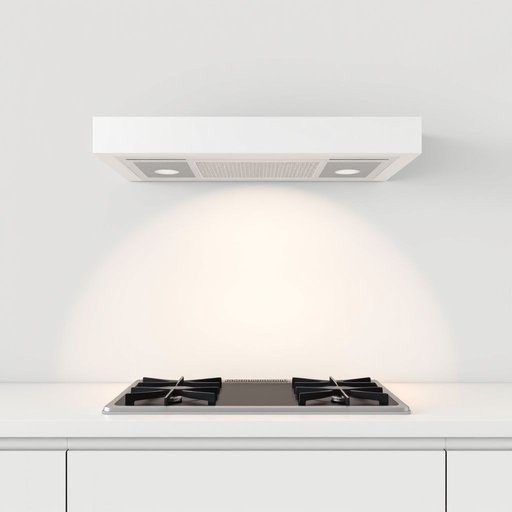

# vent

<h1 style="font-size: 2.5em; font-weight: 300; letter-spacing: 2px; margin: 0; color: #2c3e50;">
/vɛnt/
</h1>

---

---

## 例句

Before we start painting the kitchen, the vent above the stove requires thorough cleaning because the vent often collects grease and dust over time, and a clogged vent can obstruct airflow and cause unpleasant cooking odors to linger throughout the house.

*Before(/ˌbiˈfɔr/) we(/wi/) start(/stɑrt/) painting(/ˈpeɪnɪŋ/) the(/ðə/) kitchen,(/ˈkɪʧən,/) the(/ðə/) vent(/vɛnt/) above(/əˈbəv/) the(/ðə/) stove(/stoʊv/) requires(/rikˈwaɪərz/) thorough(/θəroʊ/) cleaning(/ˈklinɪŋ/) because(/bɪˈkəz/) the(/ðə/) vent(/vɛnt/) often(/ˈɔfən/) collects(/kəˈlɛkts/) grease(/gris/) and(/ənd/) dust(/dəst/) over(/ˈoʊvər/) time,(/taɪm,/) and(/ənd/) a(/ə/) clogged(/klɔgd/) vent(/vɛnt/) can(/kən/) obstruct(/əbˈstrəkt/) airflow(/ˈɛrfloʊ/) and(/ənd/) cause(/kɔz/) unpleasant(/ənˈplɛzənt/) cooking(/ˈkʊkɪŋ/) odors(/ˈoʊdərz/) to(/tɪ/) linger(/ˈlɪŋər/) throughout(/θruaʊt/) the(/ðə/) house.(/haʊs./)*

**翻译：** 在开始粉刷厨房之前，炉灶上方的通风口需要彻底清洁，因为通风口随着时间容易积聚油污和灰尘，而堵塞的通风口会阻碍空气流通，导致难闻的烹饪异味在整个房屋内弥漫。

---

## 解释

在家居生活用品的语境中，英语单词“vent”作为名词主要指的是用于排放空气、烟气或湿气的通风口或通风管道，典型使用场合包括厨房抽油烟机的排气口、浴室的排风扇口或墙壁和天花板上的通风孔等。学习者在使用“vent”时需注意其通常作可数名词，表示具体的通风装置或开口，常见搭配有“air vent”（通风口）、“exhaust vent”（排气口）和“vent cover”（通风口盖），且在表达时往往与动词如“open”、“close”、“block”等连用，描述其开启或阻塞状态。语法上，“vent”能与复数形式“vents”并用，通常不直接用作动词含义（尽管“vent”有动词用法，但此处限定名词意义），且多出现于具体、物理意义的通风设备。词源上，“vent”来源于拉丁语“ventus”，意为“风”，通过法语传入英语，体现了其与空气流动相关的本质。中文语境中“vent”准确翻译为“通风口”、“通气孔”或“排气孔”，强调其作为排放空气或气体的结构功能，属于中性词汇，无特殊褒贬色彩，也无特殊文化内涵，常见于家庭装修、家电说明书及日常生活中描述空气流通设施时使用。

---

<small style="color: #999; font-size: 0.9em;">2025-07-17 06:22:41</small>

