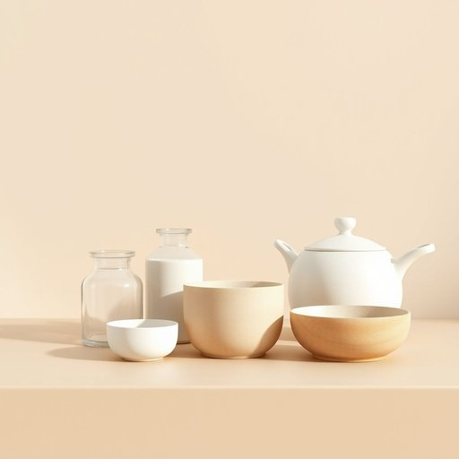

# vessel

<h1 style="font-size: 2.5em; font-weight: 300; letter-spacing: 2px; margin: 0; color: #2c3e50;">
/ˈvɛsəl/
</h1>

---

---

## 例句

Could you please make sure to wash every vessel, including the delicate glass ones and the heavy ceramic pots, thoroughly before putting them away, as leaving any residue might attract pests or cause unpleasant odors in the kitchen cupboard?

*Could(/kʊd/) you(/ju/) please(/pliz/) make(/meɪk/) sure(/ʃʊr/) to(/tɪ/) wash(/wɑʃ/) every(/ˈɛvəri/) vessel,(/ˈvɛsəl,/) including(/ˌɪnˈkludɪŋ/) the(/ðə/) delicate(/ˈdɛləkət/) glass(/glæs/) ones(/wənz/) and(/ənd/) the(/ðə/) heavy(/ˈhɛvi/) ceramic(/sərˈæmɪk/) pots,(/pɑts,/) thoroughly(/ˈθəroʊli/) before(/ˌbiˈfɔr/) putting(/ˈpʊtɪŋ/) them(/ðɛm/) away,(/əˈweɪ,/) as(/ɛz/) leaving(/ˈlivɪŋ/) any(/ˈɛni/) residue(/ˈrɛzəˌdu/) might(/maɪt/) attract(/əˈtrækt/) pests(/pɛsts/) or(/ər/) cause(/kɔz/) unpleasant(/ənˈplɛzənt/) odors(/ˈoʊdərz/) in(/ɪn/) the(/ðə/) kitchen(/ˈkɪʧən/) cupboard?(/ˈkəbərd?/)*

**翻译：** 请务必在收纳之前彻底清洗所有器皿，包括易碎的玻璃器皿和厚重的陶瓷锅，以免残留物吸引害虫或引发厨房橱柜内的不良气味。

---

## 解释

英语单词"vessel"在家居生活用品语境中作为名词，通常指用于盛装液体或其他物质的容器，如碗、杯、瓶、壶等器皿，这些器皿常见于厨房或餐厅中，用来储存、烹饪或盛装食物和饮料。在具体使用场合中，"vessel"多用于较正式或书面语境，如说明一种功能性强且具备储存或盛装作用的器皿，而非日常口语中常用的“cup”或“bowl”等词。英语学习者在使用"vessel"时应注意它是可数名词，单数形式为"vessel"，复数为"vessels"，且通常与形容词如“ceramic”、“glass”、“large”等搭配，表达器皿的材质或大小，常见表达如“ceramic vessel”（陶瓷器皿）、“water vessel”（水容器）。此外，"vessel"也具有较广义的含义，如船只，但在家居生活用品语境下需根据上下文避免混淆。词源上，"vessel"源自拉丁语"vās, vāsis"，意为容器，这一词根强调其容纳物品的功能。在中文语境中，"vessel"准确翻译为“容器”或“器皿”，指代各种具有盛装功能的器具，无褒贬色彩，属于中性词汇，通常用以描述家用餐具或厨房用具的类别。理解时应结合具体语境，以防误解为航海用的“船只”。

---

<small style="color: #999; font-size: 0.9em;">2025-07-17 06:22:41</small>

