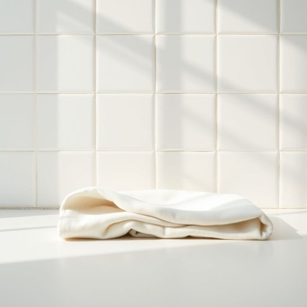

# vinegar

<h1 style="font-size: 2.5em; font-weight: 300; letter-spacing: 2px; margin: 0; color: #2c3e50;">
/ˈvɪnəgər/
</h1>

---

---

## 例句

If the stubborn stains on the kitchen tiles resist every attempt at removal, the persistent nature of the stain as a noun challenges even the most determined cleaning efforts, proving that a strategic approach involving vinegar-soaked cloths left to sit enhances the stain’s eventual disappearance more effectively than commercial cleaners.

*If(/ɪf/) the(/ðə/) stubborn(/ˈstəbərn/) stains(/steɪnz/) on(/ɔn/) the(/ðə/) kitchen(/ˈkɪʧən/) tiles(/taɪlz/) resist(/rɪˈzɪst/) every(/ˈɛvəri/) attempt(/əˈtɛmpt/) at(/æt/) removal,(/rɪˈmuvəl,/) the(/ðə/) persistent(/pərˈsɪstənt/) nature(/ˈneɪʧər/) of(/əv/) the(/ðə/) stain(/steɪn/) as(/ɛz/) a(/ə/) noun(/naʊn/) challenges(/ˈʧælənʤɪz/) even(/ˈivɪn/) the(/ðə/) most(/moʊst/) determined(/dɪˈtərmənd/) cleaning(/ˈklinɪŋ/) efforts,(/ˈɛfərts,/) proving(/ˈpruvɪŋ/) that(/ðət/) a(/ə/) strategic(/strəˈtiʤɪk/) approach(/əˈproʊʧ/) involving(/ˌɪnˈvɑlvɪŋ/) vinegar-soaked(/vinegar-soaked*/) cloths(/klɔθs/) left(/lɛft/) to(/tɪ/) sit(/sɪt/) enhances(/ɛnˈhænsɪz/) the(/ðə/) stain’s(/stain’s*/) eventual(/əˈvɛnʧuəl/) disappearance(/ˌdɪsəˈpɪrəns/) more(/mɔr/) effectively(/ˈifɛktɪvli/) than(/ðən/) commercial(/kəˈmərʃəl/) cleaners.(/ˈklinərz./)*

**翻译：** 如果厨房瓷砖上的顽固污渍屡次尝试都难以去除，那么作为名词的“污渍”那种顽固本质甚至挑战了最坚定的清洁努力，这也证明了采用策略性方法——用醋浸湿的布料敷置一段时间——比商业清洁剂更能有效促进污渍的最终消失。

---

## 解释

vinegar作为名词，指的是醋，在家居生活用品的语境中，通常用于厨房调味或清洁等场合，如烹饪时添加酸味调料，或利用其酸性特性进行家居去污、除臭。英语学习者使用vinegar时需注意其不可数名词性质，通常不用复数形式，但可以通过量词或修饰语表达量，如a bottle of vinegar或some vinegar。常见搭配包括apple cider vinegar（苹果醋）、white vinegar（白醋）以及vinegar and oil dressing（醋和油的沙拉酱），这些固定搭配有助于提升表达准确性和地道感。vinegar的词源来自拉丁语vinum acer，意指酸的葡萄酒，反映其原始生产原料和酸味特征。在中文语境中，vinegar准确翻译为醋，这是厨房和家庭清洁中普遍使用的酸性液体，其含义中性，不带褒贬色彩，文化内涵较为普通，但在某些英语习语中，如to eat vinegar或sour as vinegar可能带有比喻性的负面情绪表达，需区别对待。

---

<small style="color: #999; font-size: 0.9em;">2025-07-17 06:22:41</small>

