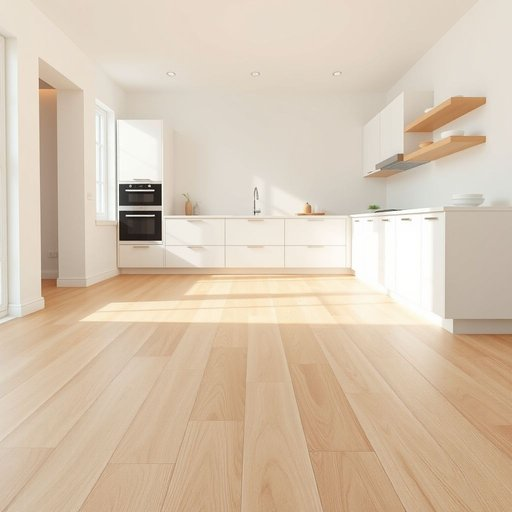

# vinyl

<h1 style="font-size: 2.5em; font-weight: 300; letter-spacing: 2px; margin: 0; color: #2c3e50;">
/ˈvaɪnəl/
</h1>

---

---

## 例句

When we decided to renovate the kitchen, we chose a durable vinyl for the flooring, which not only mimics the look of natural wood with its intricate patterns and subtle textures but also offers easy maintenance and resistance to spills, making it perfect for a busy household like ours.

*When(/wɪn/) we(/wi/) decided(/ˌdɪˈsaɪdɪd/) to(/tɪ/) renovate(/ˈrɛnəˌveɪt/) the(/ðə/) kitchen,(/ˈkɪʧən,/) we(/wi/) chose(/ʧoʊz/) a(/ə/) durable(/ˈdʊrəbəl/) vinyl(/ˈvaɪnəl/) for(/fər/) the(/ðə/) flooring,(/ˈflɔrɪŋ,/) which(/wɪʧ/) not(/nɑt/) only(/ˈoʊnli/) mimics(/ˈmɪmɪks/) the(/ðə/) look(/lʊk/) of(/əv/) natural(/ˈnæʧərəl/) wood(/wʊd/) with(/wɪθ/) its(/ɪts/) intricate(/ˈɪntrəkət/) patterns(/ˈpætərnz/) and(/ənd/) subtle(/ˈsətəl/) textures(/ˈtɛksʧərz/) but(/bət/) also(/ˈɔlsoʊ/) offers(/ˈɔfərz/) easy(/ˈizi/) maintenance(/ˈmeɪntənəns/) and(/ənd/) resistance(/rɪˈzɪstəns/) to(/tɪ/) spills,(/spɪlz,/) making(/ˈmeɪkɪŋ/) it(/ɪt/) perfect(/ˈpərˌfɪkt/) for(/fər/) a(/ə/) busy(/ˈbɪzi/) household(/ˈhaʊsˌhoʊld/) like(/laɪk/) ours.(/ɑrz./)*

**翻译：** 当我们决定翻新厨房时，选择了一种耐用的乙烯基地板。它不仅通过复杂的纹理和细腻的质感模拟天然木材的外观，还便于清洁，且具备防泼溅功能，非常适合像我们这样繁忙的家庭使用。

---

## 解释

英语单词“vinyl”作为名词在家居生活用品的语境中，主要指乙烯基材料，这是一种合成塑料，广泛用于地板铺设（如乙烯基地板）、墙纸、家具覆盖物以及窗帘等家居装饰品。使用“vinyl”时，英语学习者应注意其常见搭配如“vinyl flooring”（乙烯基地板）、“vinyl wallpaper”（乙烯基墙纸）以及“vinyl chair cover”（乙烯基椅套），此类搭配多数指具体的材料类型或产品，且“vinyl”作为不可数名词时通常不加复数形式。语法上，“vinyl”可用作不可数名词或可数名词（如指唱片时），但在家居用品中多为不可数。词源上，“vinyl”源自拉丁语“vinum”（葡萄酒），通过化学用语引申为含乙烯基基团的化合物，20世纪作为塑料材料广泛使用后进入日常词汇。中文中，“vinyl”准确译为“乙烯基”，在家居领域通常指用乙烯基材料制成的塑料膜或合成材料，没有贬义，属于中性词，体现出现代家居对经济实用且耐用材料的需求，但有时在环保语境中可能因塑料制品对环境的影响被讨论。整体而言，“vinyl”在家居用品语境中即指以乙烯基材料制成的各类塑料制品，是现代生活中常见且实用的材料名称。

---

<small style="color: #999; font-size: 0.9em;">2025-07-17 06:22:41</small>

