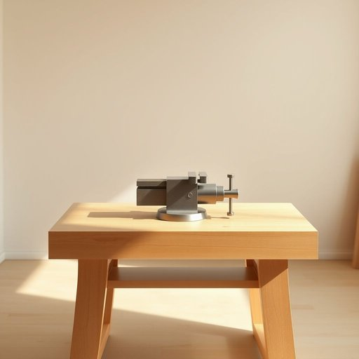

# vise

<h1 style="font-size: 2.5em; font-weight: 300; letter-spacing: 2px; margin: 0; color: #2c3e50;">
/vaɪs/
</h1>

---

---

## 例句

Could you please tighten the vise on the workbench a little more, since the wooden frame I’m repairing keeps slipping, and I need it to stay perfectly still while I apply the glue and nails?

*Could(/kʊd/) you(/ju/) please(/pliz/) tighten(/ˈtaɪtən/) the(/ðə/) vise(/vaɪs/) on(/ɔn/) the(/ðə/) workbench(/ˈwərkˌbɛnʧ/) a(/ə/) little(/ˈlɪtəl/) more,(/mɔr,/) since(/sɪns/) the(/ðə/) wooden(/ˈwʊdən/) frame(/freɪm/) I’m(/i’m*/) repairing(/rɪˈpɛrɪŋ/) keeps(/kips/) slipping,(/sˈlɪpɪŋ,/) and(/ənd/) I(/aɪ/) need(/nid/) it(/ɪt/) to(/tɪ/) stay(/steɪ/) perfectly(/ˈpərfəktli/) still(/stɪl/) while(/waɪl/) I(/aɪ/) apply(/əˈplaɪ/) the(/ðə/) glue(/glu/) and(/ənd/) nails?(/neɪlz?/)*

**翻译：** 您能否将工作台上的虎钳再拧紧一些？因为我正在修理的木框架总是滑动，而我需要它在涂胶和钉钉子时保持完全稳定。

---

## 解释

英语单词'vise'作为名词在家居生活用品的语境中，指的是一种固定工件用的夹钳或虎钳，通常安装在工作台边缘，用于夹紧木材或金属等材料，便于加工、锯切或组装。具体使用场合多见于手工制作、家具修理、金工或DIY项目中，是机械和家庭工作坊常见的工具。英语学习者需要注意的是，'vise'在美式英语中是常用拼写，而英式英语通常写作'vice'，但含义相同，均指夹具工具；此外，虽然名词形式较为固定，常见搭配有“bench vise”（台虎钳）、“pipe vise”（管钳）等，使用时多用单数形式，复数为'vises'。语法上，'vise'作为可数名词，前面可加冠词或数量词，常用于介词短语中，如“clamp the wood in the vise”（把木材夹在虎钳里）。词源方面，'vise'源自拉丁语“vitium”，意为缺陷、瑕疵，后来转指束缚物，经过中古法语进入英语，含义演变为夹紧工具。中文语境中，'vise'准确翻译为“虎钳”或“夹钳”，强调其固定和夹持功能，在日常生活和专业领域均有广泛应用，无褒贬色彩，仅作为工具名称出现，文化内涵较为中性。

---

<small style="color: #999; font-size: 0.9em;">2025-07-17 06:22:41</small>

