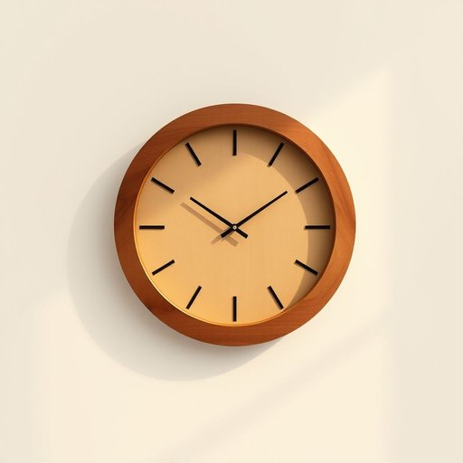

# wall-clock

<h1 style="font-size: 2.5em; font-weight: 300; letter-spacing: 2px; margin: 0; color: #2c3e50;">
/wall-clock*/
</h1>

---

---

## 例句

I noticed that the old wall-clock hanging in the living room, which has a beautifully intricate wooden frame carved with delicate patterns and a slightly faded face, has stopped ticking again, so I’m planning to take it down this afternoon, clean the mechanism carefully, and see if I can fix it myself before considering whether it needs professional repair or replacement.

*I(/aɪ/) noticed(/ˈnoʊtɪst/) that(/ðət/) the(/ðə/) old(/oʊld/) wall-clock(/wall-clock*/) hanging(/ˈhæŋɪŋ/) in(/ɪn/) the(/ðə/) living(/ˈlɪvɪŋ/) room,(/rum,/) which(/wɪʧ/) has(/həz/) a(/ə/) beautifully(/ˈbjutəfli/) intricate(/ˈɪntrəkət/) wooden(/ˈwʊdən/) frame(/freɪm/) carved(/kɑrvd/) with(/wɪθ/) delicate(/ˈdɛləkət/) patterns(/ˈpætərnz/) and(/ənd/) a(/ə/) slightly(/sˈlaɪtli/) faded(/ˈfeɪdɪd/) face,(/feɪs,/) has(/həz/) stopped(/stɑpt/) ticking(/ˈtɪkɪŋ/) again,(/əˈgɛn,/) so(/soʊ/) I’m(/i’m*/) planning(/ˈplænɪŋ/) to(/tɪ/) take(/teɪk/) it(/ɪt/) down(/daʊn/) this(/ðɪs/) afternoon,(/ˌæftərˈnun,/) clean(/klin/) the(/ðə/) mechanism(/ˈmɛkəˌnɪzəm/) carefully,(/ˈkɛrfəli,/) and(/ənd/) see(/si/) if(/ɪf/) I(/aɪ/) can(/kən/) fix(/fɪks/) it(/ɪt/) myself(/ˌmaɪˈsɛlf/) before(/ˌbiˈfɔr/) considering(/kənˈsɪdərɪŋ/) whether(/ˈwɛðər/) it(/ɪt/) needs(/nidz/) professional(/prəˈfɛʃənəl/) repair(/rɪˈpɛr/) or(/ər/) replacement.(/rɪˈpleɪsmənt./)*

**翻译：** 我注意到客厅里挂着的那只老挂钟又停了，挂钟拥有一个雕刻着精美图案的复杂木质框架，表盘略显褪色。今天下午我打算把它取下来，仔细清理机械装置，看看能否自己修复，之后再考虑是否需要专业维修或更换。

---

## 解释

“wall-clock”作为名词在家居生活用品的语境中，指的是挂在墙上的时钟，通常用来显示时间，既可作为实用工具，也具有装饰作用。具体使用场合主要是家庭、办公室、教室等室内空间，用于醒目展示时间，便于多人数同时查看。英语学习者在使用“wall-clock”时需注意它是复合名词，通常前者“wall”修饰后者“clock”，整体作名词使用，且在复数形式中一般加“s”变为“wall-clocks”，用法类似普通名词；在表达时常见的搭配有“一只大挂钟”“一只复古挂钟”等，形容词置于前，且不可与“clock on the wall”混淆，后者更强调动作或状态。词源方面，“wall-clock”来源于“wall”（墙壁）和“clock”（时钟）两个简单词的组合，起初深受工业革命后机械时钟普及影响，此类挂钟成为家庭或公共场所时间显示的标准设备，体现了功能与空间利用的结合。中文语境中，“wall-clock”准确翻译为“挂钟”或“挂墙时钟”，强调其悬挂于墙面作为时间显示的特点。此词无明显褒贬或特殊文化色彩，属于中性且常用的名词，表达简洁明了，适合所有正式或非正式语境使用。

---

<small style="color: #999; font-size: 0.9em;">2025-07-17 06:22:41</small>

