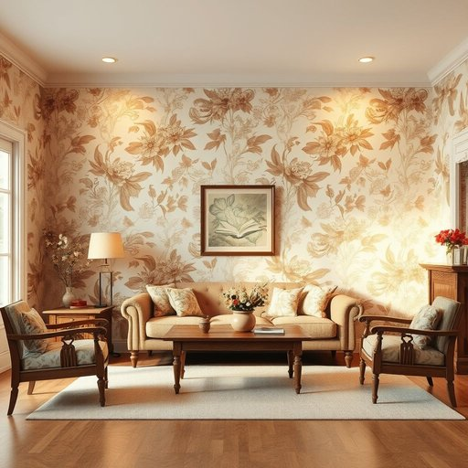

# wall-paper

<h1 style="font-size: 2.5em; font-weight: 300; letter-spacing: 2px; margin: 0; color: #2c3e50;">
/wall-paper*/
</h1>

---

---

## 例句

After spending hours comparing different patterns and textures online, she finally chose a vintage floral wallpaper that, despite its bold colours and intricate design, perfectly complemented the antique furnishings and subtle lighting in their newly renovated living room.

*After(/ˈæftər/) spending(/ˈspɛndɪŋ/) hours(/aʊərz/) comparing(/kəmˈpɛrɪŋ/) different(/ˈdɪfərənt/) patterns(/ˈpætərnz/) and(/ənd/) textures(/ˈtɛksʧərz/) online,(/ˈɔnˌlaɪn,/) she(/ʃi/) finally(/ˈfaɪnəli/) chose(/ʧoʊz/) a(/ə/) vintage(/ˈvɪntɪʤ/) floral(/ˈflɔrəl/) wallpaper(/ˈwɔlˌpeɪpər/) that,(/ðət,/) despite(/dɪˈspaɪt/) its(/ɪts/) bold(/boʊld/) colours(/colours*/) and(/ənd/) intricate(/ˈɪntrəkət/) design,(/dɪˈzaɪn,/) perfectly(/ˈpərfəktli/) complemented(/ˈkɑmpləˌmɛntɪd/) the(/ðə/) antique(/ænˈtik/) furnishings(/ˈfərnɪʃɪŋz/) and(/ənd/) subtle(/ˈsətəl/) lighting(/ˈlaɪtɪŋ/) in(/ɪn/) their(/ðɛr/) newly(/ˈnuli/) renovated(/ˈrɛnəˌveɪtɪd/) living(/ˈlɪvɪŋ/) room.(/rum./)*

**翻译：** 经过数小时对比各种图案和质地后，她最终选择了一款复古花卉墙纸，尽管色彩大胆且设计复杂，但却与他们新装修客厅中的古董家具和柔和灯光完美契合。

---

## 解释

英语单词wall-paper作为名词，在家居生活用品领域指用于覆盖或装饰室内墙面的纸质或类似材料，通常表现为带有各种图案、颜色或纹理的薄片，用以美化居住环境，掩盖墙面缺陷或营造特定的氛围，具体使用场合多见于装修、室内设计、家居布置等语境，如installing wallpaper in the living room（在客厅贴壁纸）或choose a floral wallpaper pattern（选择花卉图案的壁纸），英语学习者在使用时应注意，wallpaper通常作为不可数名词出现，如put up wallpaper而非put up wall-papers，但在某些场合也能以复数形式出现指多种不同样式的壁纸，此外，wallpaper可用作动词，意指贴壁纸，但用法和含义需区别明确，常见搭配包括wallpaper roll（壁纸卷）、peel off wallpaper（撕下壁纸）等，词源上，wallpaper一词由wall（墙）和paper（纸）组成，起源于15世纪末至16世纪，最初指用于墙面装饰的纸张，是对传统涂漆或挂布装饰的一种替代品，随着印刷技术的发展，其图案和品质不断丰富，中文语境中，wall-paper准确翻译为壁纸，这一词汇在实际应用中涵盖同义词墙纸，但壁纸更为正式且应用广泛，均指贴于墙面以装饰或保护作用的纸质材料，文化层面上，壁纸在西方和中国均为常见室内装饰元素，通常无褒贬色彩，但不同图案和风格可能会反映个人审美与生活品味，总之，理解wallpaper应结合其功能性和装饰性的双重属性，掌握其不可数名词的用法及与动词形式的区分，有助于准确表达和理解相关家居装修话题。

---

<small style="color: #999; font-size: 0.9em;">2025-07-17 06:22:41</small>

