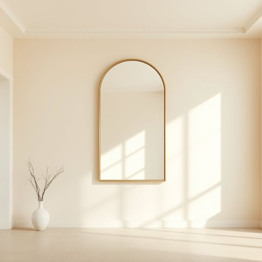

# wall

<h1 style="font-size: 2.5em; font-weight: 300; letter-spacing: 2px; margin: 0; color: #2c3e50;">
/wɔl/
</h1>

---

---

## 例句

Could you please help me hang this large mirror on the living room wall, which has recently been painted a soft cream colour, so that it reflects more natural light and makes the space feel brighter and more inviting?

*Could(/kʊd/) you(/ju/) please(/pliz/) help(/hɛlp/) me(/mi/) hang(/hæŋ/) this(/ðɪs/) large(/lɑrʤ/) mirror(/ˈmɪrər/) on(/ɔn/) the(/ðə/) living(/ˈlɪvɪŋ/) room(/rum/) wall,(/wɔl,/) which(/wɪʧ/) has(/həz/) recently(/ˈrisəntli/) been(/bɪn/) painted(/ˈpeɪnɪd/) a(/ə/) soft(/sɔft/) cream(/krim/) colour,(/ˈkələr,/) so(/soʊ/) that(/ðət/) it(/ɪt/) reflects(/rɪˈflɛkts/) more(/mɔr/) natural(/ˈnæʧərəl/) light(/laɪt/) and(/ənd/) makes(/meɪks/) the(/ðə/) space(/speɪs/) feel(/fil/) brighter(/ˈbraɪtər/) and(/ənd/) more(/mɔr/) inviting?(/ˌɪnˈvaɪtɪŋ?/)*

**翻译：** 您能帮我把这面大镜子挂在客厅的墙上吗？客厅墙面最近刚刷成了柔和的米色，这样镜子可以反射更多的自然光，让空间显得更明亮、更温馨。

---

## 解释

英语单词“wall”在家居生活用品的语境中作为名词，主要指室内或室外建筑结构中将空间分隔开来的垂直面，如房间的四面墙、隔断墙或承重墙。具体使用场合包括描述房屋内部结构、装修设计、挂画或安装家居用品时提及的墙壁，如“hang a picture on the wall”（在墙上挂画）或“paint the walls”（粉刷墙壁）。英语学习者在使用“wall”时需要注意其可数性，通常指具体的一面墙（a wall），也可复数形式（walls）表示多面墙，且与介词搭配时常用“on the wall”表示“在墙上”，“against the wall”表示“靠着墙”；此外，表达“拆墙”、“修墙”等动作时多用动词搭配，如“build a wall”、“tear down a wall”。从词源上看，“wall”来源于古英语“weall”，源自拉丁语“vallum”，意指防御用的土墙或围墙，反映了其起初作为防护或分隔结构的功能。在中文语境中，“wall”通常准确翻译为“墙”或“墙壁”，涵盖承重墙、隔断墙及装饰墙等具体含义，强调其作为建筑内或外空间界限的作用；没有明显的褒贬色彩，但在文化表达中“warm walls”可能隐含舒适、安全的生活环境。整体而言，“wall”在家居环境中是一个基础且日常频繁使用的词汇，对理解房屋结构和相关生活场景十分重要。

---

<small style="color: #999; font-size: 0.9em;">2025-07-17 06:22:41</small>

