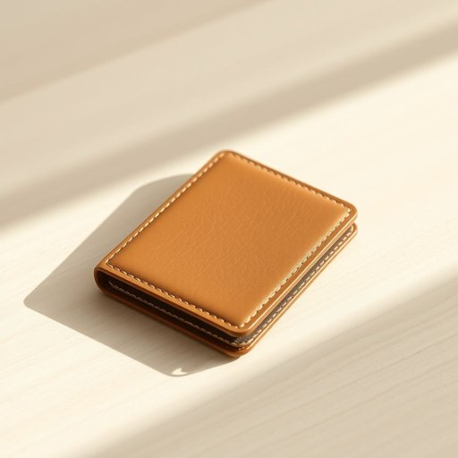

# wallet

<h1 style="font-size: 2.5em; font-weight: 300; letter-spacing: 2px; margin: 0; color: #2c3e50;">
/ˈwɔlət/
</h1>

---

---

## 例句

I finally found my wallet, which relieved me immensely since I’d been worrying about losing it all morning.

*I(/aɪ/) finally(/ˈfaɪnəli/) found(/faʊnd/) my(/maɪ/) wallet,(/ˈwɔlət,/) which(/wɪʧ/) relieved(/rɪˈlivd/) me(/mi/) immensely(/ˌɪˈmɛnsli/) since(/sɪns/) I’d(/i’d*/) been(/bɪn/) worrying(/ˈwəriɪŋ/) about(/əˈbaʊt/) losing(/ˈluzɪŋ/) it(/ɪt/) all(/ɔl/) morning.(/ˈmɔrnɪŋ./)*

**翻译：** 我终于找到了我的钱包，心里大大的松了一口气，因为我整整一上午都在担心把它丢了。

---

## 解释

英语单词wallet作为名词在家居生活用品的语境中，通常指的是一种用来装纸币、信用卡、身份证等小件物品的皮夹或钱夹，常见于日常生活中携带现金和卡片的场合，如外出购物、出门旅游或日常通勤时使用。wallet在语法上是可数名词，常与表示所有者的物主代词连用，如my wallet、her wallet，也常与包含内容的名词搭配使用，如credit card wallet（信用卡夹）、leather wallet（皮质钱包）等，表达时需注意其复数形式wallets。使用时，英语学习者应注意wallet与purse的区分，在美式英语中purse多指女士用的钱包，而wallet则更多指男士用的钱夹。词源上，wallet源自古英语weallet或wælg（意为袋子），经过中世纪英语演变而来，最初泛指装载物品的小袋子，逐渐特指放置钱财的皮夹。其中文翻译一般为“钱包”或“钱夹”，对应的家居生活用品概念明确且无褒贬色彩，属于中性词汇，文化上钱包不仅代表携带现金和证件的实用工具，还隐含个人财务管理和安全意识。在中文语境中，钱包一词准确涵盖了该单词的实用属性，使用时无需额外文化转换，但应注意与钱包在不同语境中可能引申的象征意义保持区分。

---

<small style="color: #999; font-size: 0.9em;">2025-07-17 06:22:41</small>

