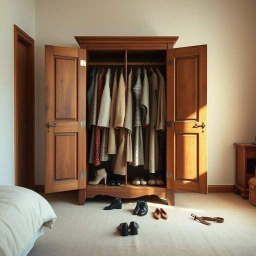

# wardrobe

<h1 style="font-size: 2.5em; font-weight: 300; letter-spacing: 2px; margin: 0; color: #2c3e50;">
/ˈwɔrˌdroʊb/
</h1>

---

---

## 例句

After struggling to find an outfit suitable for the dinner party among the clutter of shoes and accessories scattered across the floor, she finally opened her old wooden wardrobe, which, despite its worn appearance and creaky hinges, still held neatly arranged coats, dresses, and scarves that had been carefully hung according to season and occasion.

*After(/ˈæftər/) struggling(/ˈstrəgəlɪŋ/) to(/tɪ/) find(/faɪnd/) an(/ən/) outfit(/ˈaʊtˌfɪt/) suitable(/ˈsutəbəl/) for(/fər/) the(/ðə/) dinner(/ˈdɪnər/) party(/ˈpɑrti/) among(/əˈməŋ/) the(/ðə/) clutter(/ˈklətər/) of(/əv/) shoes(/ʃuz/) and(/ənd/) accessories(/ækˈsɛsəriz/) scattered(/ˈskætərd/) across(/əˈkrɔs/) the(/ðə/) floor,(/flɔr,/) she(/ʃi/) finally(/ˈfaɪnəli/) opened(/ˈoʊpənd/) her(/hər/) old(/oʊld/) wooden(/ˈwʊdən/) wardrobe,(/ˈwɔrˌdroʊb,/) which,(/wɪʧ,/) despite(/dɪˈspaɪt/) its(/ɪts/) worn(/wɔrn/) appearance(/əˈpɪrəns/) and(/ənd/) creaky(/ˈkriki/) hinges,(/ˈhɪnʤɪz,/) still(/stɪl/) held(/hɛld/) neatly(/ˈnitli/) arranged(/əreɪnʤd/) coats,(/koʊts,/) dresses,(/ˈdrɛsɪz,/) and(/ənd/) scarves(/skɑrvz/) that(/ðət/) had(/hæd/) been(/bɪn/) carefully(/ˈkɛrfəli/) hung(/həŋ/) according(/əˈkɔrdɪŋ/) to(/tɪ/) season(/ˈsizən/) and(/ənd/) occasion.(/əˈkeɪʒən./)*

**翻译：** 在纷乱的地板上散落着鞋子和饰品，她苦苦寻找一套适合晚宴的服装后，终于打开了那只旧木衣柜。尽管衣柜外观陈旧且门轴吱吱作响，但里面的外套、连衣裙和围巾依然整齐地悬挂着，且按照季节和场合细心分类。

---

## 解释

英语单词"wardrobe"作为名词，在家居生活用品语境中通常指的是放置衣物的家具，即衣柜或衣橱，使用场合多见于描述家庭卧室、储藏空间、家具购买及家居布置等。英语学习者需注意，wardrobe多用作可数名词，表示一个具体的衣柜；在复数形式中为"wardrobes"，此外，它也可以引申为某人拥有的全部服装，如"She has an extensive wardrobe"（她有很多衣服），此时强调的是服装的集合。常见搭配包括"a built-in wardrobe"（嵌入式衣柜）、"a freestanding wardrobe"（独立衣柜）以及"wardrobe door"（衣柜门）等。语法上，wardrobe用作名词时通常作主语、宾语或定语，要求与冠词连用或在特定语境下直接使用。词源方面，wardrobe起源于中古英语，源自古法语"warderobe"，意为“保护衣物的地方”，其中“ward”含有“守卫、保护”之意，“robe”指衣服，体现了其作为存放衣物的家具的功能。中文中，wardrobe准确翻译为“衣柜”或“衣橱”，强调家具的存储功能，而非单纯的衣物集合；在不同地区，“衣橱”偏向嵌入式大柜，“衣柜”常指独立式的家具。该词在日常生活中无明显褒贬或特殊色彩，属于中性常用词汇，且因其与个人衣物的管理密切相关，常用于表达整洁、衣物收纳等生活细节。理解和使用wardrobe时，需结合具体语境辨识其指家具还是服装集合，以避免误解。

---

<small style="color: #999; font-size: 0.9em;">2025-07-17 06:22:41</small>

