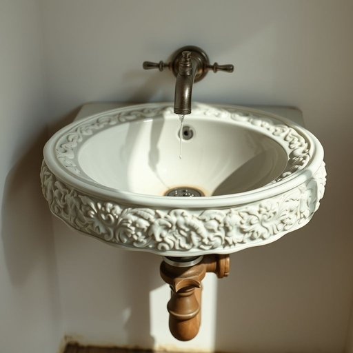

# washbasin

<h1 style="font-size: 2.5em; font-weight: 300; letter-spacing: 2px; margin: 0; color: #2c3e50;">
/ˈwɑʃˌbeɪsən/
</h1>

---

---

## 例句

After noticing the persistent leak beneath the old washbasin, which had a beautifully carved porcelain design but unfortunately outdated plumbing, she decided to call a plumber to not only fix the tap but also to inspect the pipes, ensuring that no further water damage would occur in the bathroom.

*After(/ˈæftər/) noticing(/ˈnoʊtɪsɪŋ/) the(/ðə/) persistent(/pərˈsɪstənt/) leak(/lik/) beneath(/bɪˈniθ/) the(/ðə/) old(/oʊld/) washbasin,(/ˈwɑʃˌbeɪsən,/) which(/wɪʧ/) had(/hæd/) a(/ə/) beautifully(/ˈbjutəfli/) carved(/kɑrvd/) porcelain(/ˈpɔrsələn/) design(/dɪˈzaɪn/) but(/bət/) unfortunately(/ənˈfɔrʧənətli/) outdated(/ˈaʊtˌdeɪtɪd/) plumbing,(/ˈpləmɪŋ,/) she(/ʃi/) decided(/ˌdɪˈsaɪdɪd/) to(/tɪ/) call(/kɔl/) a(/ə/) plumber(/ˈpləmər/) to(/tɪ/) not(/nɑt/) only(/ˈoʊnli/) fix(/fɪks/) the(/ðə/) tap(/tæp/) but(/bət/) also(/ˈɔlsoʊ/) to(/tɪ/) inspect(/ˌɪnˈspɛkt/) the(/ðə/) pipes,(/paɪps,/) ensuring(/ɪnˈʃʊrɪŋ/) that(/ðət/) no(/noʊ/) further(/ˈfərðər/) water(/ˈwɔtər/) damage(/ˈdæmɪʤ/) would(/wʊd/) occur(/əˈkər/) in(/ɪn/) the(/ðə/) bathroom.(/ˈbæθˌrum./)*

**翻译：** 注意到老旧洗手盆下方持续漏水，尽管洗手盆有着精美的瓷刻设计，但管道已显陈旧，她决定请水管工不仅修理水龙头，还检查管道，确保浴室不会再发生进一步的水损害。

---

## 解释

英语单词“washbasin”作为名词，指的是家庭或公共场所中用来洗手、洗脸的洗脸盆，通常安装在浴室或洗手间里，是洁净和卫生的重要用具。在家居生活用品的语境下，“washbasin”多用于描述固定装置，区别于便携式或其他类型的水盆。英语学习者使用时需注意，“washbasin”是可数名词，单复数形式分别为“washbasin”和“washbasins”，且常与介词短语连用，如“the washbasin in the bathroom”或“a clean washbasin”；此外，“washbasin”一般作为主语或宾语出现，构成常见搭配如“washbasin tap”（洗脸盆水龙头）、“washbasin cabinet”（洗脸盆柜）。从词源来看，“washbasin”由“wash”（洗）和“basin”（盆）组合而成，含义直接明了，属复合词，起源于英语日常生活的描述需要。该词在中文语境中准确翻译为“洗脸盆”或“洗手盆”，是室内固定的卫浴设施，不含贬义或褒义，属于中性词，且普遍使用，不涉及特殊文化内涵或语言色彩，适用于正式或非正式的交流场合。

---

<small style="color: #999; font-size: 0.9em;">2025-07-17 06:22:41</small>

