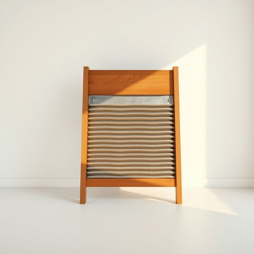

# washboard

<h1 style="font-size: 2.5em; font-weight: 300; letter-spacing: 2px; margin: 0; color: #2c3e50;">
/ˈwɑʃˌbɔrd/
</h1>

---

---

## 例句

When her discovery of the vintage washboard, an essential tool for hand-washing delicate fabrics before the advent of modern washing machines, sparked nostalgic conversations about domestic chores in bygone eras, the preservation of its sturdy wooden frame and ridged metal surface became a symbol of enduring craftsmanship.

*When(/wɪn/) her(/hər/) discovery(/ˌdɪˈskəvri/) of(/əv/) the(/ðə/) vintage(/ˈvɪntɪʤ/) washboard,(/ˈwɑʃˌbɔrd,/) an(/ən/) essential(/ɛˈsɛnʃəl/) tool(/tul/) for(/fər/) hand-washing(/hand-washing*/) delicate(/ˈdɛləkət/) fabrics(/ˈfæbrɪks/) before(/ˌbiˈfɔr/) the(/ðə/) advent(/ˈædˌvɛnt/) of(/əv/) modern(/ˈmɑdərn/) washing(/ˈwɑʃɪŋ/) machines,(/məˈʃinz,/) sparked(/spɑrkt/) nostalgic(/nɔˈstælʤɪk/) conversations(/ˌkɑnvərˈseɪʃənz/) about(/əˈbaʊt/) domestic(/dəˈmɛstɪk/) chores(/ʧɔrz/) in(/ɪn/) bygone(/ˈbaɪˌgɔn/) eras,(/ˈɪrəz,/) the(/ðə/) preservation(/ˌprɛzərˈveɪʃən/) of(/əv/) its(/ɪts/) sturdy(/ˈstərdi/) wooden(/ˈwʊdən/) frame(/freɪm/) and(/ənd/) ridged(/rɪʤd/) metal(/ˈmɛtəl/) surface(/ˈsərfəs/) became(/bɪˈkeɪm/) a(/ə/) symbol(/ˈsɪmbəl/) of(/əv/) enduring(/ɪnˈdʊrɪŋ/) craftsmanship.(/ˈkræftsmənˌʃɪp./)*

**翻译：** 当她发现那块复古的搓板——现代洗衣机出现之前搓洗娇嫩织物的重要工具——时，坚固的木质框架和凹凸金属表面的保存引发了关于过去年代家务的怀旧话题，成为耐用工艺的象征。

---

## 解释

英语单词“washboard”作为名词在家居生活用品的语境中通常指一种传统的洗衣板，用于手工洗涤衣物时擦洗以去除污渍，使用场合多见于无洗衣机或停水时的手洗环境及历史文献描写。英语学习者使用该词时应注意其可数名词属性，复数形式为“washboards”，描述物品时常与“laundry”“washing”或“clothes”搭配，如“use a washboard to scrub clothes”（用洗衣板擦洗衣服）；此外，该词还可以引申为粗糙的表面或道路，需根据语境判断。词源上“washboard”由“wash”（洗）与“board”（板）组合而成，最早出现于19世纪，指便携式木质或金属制成带有波浪形肋条的洗衣辅助工具，反映机械洗衣普及前的生活状态。在中文语境中，“washboard”准确翻译为“洗衣板”，是传统家用工具的专用名词，强调其实用性和历史性，不含贬义或褒义；需要注意的是，“洗衣板”在现代家庭中多作为怀旧或装饰品，非主流实用工具，因此该词在当代语境中具有一定的年代感和文化怀旧色彩，不宜与现代电动洗衣设备混淆。

---

<small style="color: #999; font-size: 0.9em;">2025-07-17 06:22:41</small>

