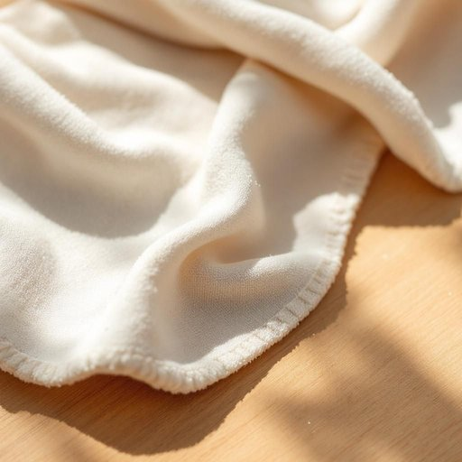

# washcloth

<h1 style="font-size: 2.5em; font-weight: 300; letter-spacing: 2px; margin: 0; color: #2c3e50;">
/ˈwɑʃˌklɔθ/
</h1>

---

---

## 例句

After carefully inspecting the delicate fabric for any signs of discoloration, she decided to dampen a soft washcloth with lukewarm water infused with a hint of lavender oil, so that when she gently blotted the stubborn stain, the combination of soothing fragrance and tender touch would both preserve the material's integrity and gradually lift the blemish without causing any damage.

*After(/ˈæftər/) carefully(/ˈkɛrfəli/) inspecting(/ˌɪnˈspɛktɪŋ/) the(/ðə/) delicate(/ˈdɛləkət/) fabric(/ˈfæbrɪk/) for(/fər/) any(/ˈɛni/) signs(/saɪnz/) of(/əv/) discoloration,(/dɪˌskələrˈeɪʃən,/) she(/ʃi/) decided(/ˌdɪˈsaɪdɪd/) to(/tɪ/) dampen(/ˈdæmpən/) a(/ə/) soft(/sɔft/) washcloth(/ˈwɑʃˌklɔθ/) with(/wɪθ/) lukewarm(/ˈlukˈwɔrm/) water(/ˈwɔtər/) infused(/ˌɪnfˈjuzd/) with(/wɪθ/) a(/ə/) hint(/hɪnt/) of(/əv/) lavender(/ˈlævəndər/) oil,(/ɔɪl,/) so(/soʊ/) that(/ðət/) when(/wɪn/) she(/ʃi/) gently(/ˈʤɛntli/) blotted(/ˈblɑtəd/) the(/ðə/) stubborn(/ˈstəbərn/) stain,(/steɪn,/) the(/ðə/) combination(/ˌkɑmbəˈneɪʃən/) of(/əv/) soothing(/ˈsuðɪŋ/) fragrance(/ˈfreɪgrəns/) and(/ənd/) tender(/ˈtɛndər/) touch(/təʧ/) would(/wʊd/) both(/boʊθ/) preserve(/prɪˈzərv/) the(/ðə/) material's(/material's*/) integrity(/ˌɪnˈtɛgrəti/) and(/ənd/) gradually(/ˈgræʤuəli/) lift(/lɪft/) the(/ðə/) blemish(/ˈblɛmɪʃ/) without(/wɪˈθaʊt/) causing(/ˈkɔzɪŋ/) any(/ˈɛni/) damage.(/ˈdæmɪʤ./)*

**翻译：** 在仔细检查那块娇嫩的面料是否有任何褪色迹象后，她决定用微温的水稍微润湿一块柔软的洗布，水中还加入了一丝薰衣草精油。这样，当她轻轻按拭那顽固的污渍时，宜人的香气与温柔的触感相结合，不仅能保护面料的完整性，还能逐渐去除污点，而不会造成任何损伤。

---

## 解释

英语单词“washcloth”作为名词，指的是一种家居生活用品，通常为小块的方形布，用于洗脸或洗澡时擦拭身体。它常见于浴室环境，尤其在清洁和个人卫生场合出现，是洗脸巾或洗浴用的擦澡布的意思。英语学习者使用“washcloth”时需注意它通常为可数名词，复数形式为“washcloths”，且多用作具体物品名词，不宜与抽象概念混用，常见搭配包括“use a washcloth”（使用洗脸巾）、“wet the washcloth”（把洗脸巾弄湿）、“hang up the washcloth to dry”（挂起洗脸巾晾干）等表达，体现了其实用功能。词源方面，“washcloth”由“wash”（洗涤）和“cloth”（布）组成，直译即“洗用的布”，起源直接反映了其用途，属于合成词，结构简单明了。中文语境中，“washcloth”多准确翻译为“洗脸巾”或“擦脸布”，不过在具体使用时也可能指代“毛巾”或“小方巾”，视具体产品和地区习惯，有时会与“毛巾”（towel）区分开来，洗脸巾相对小且质地较柔软。该词语在英语中无特殊褒贬色彩，仅为中性名词，文化内涵主要体现在欧美洁净习惯和浴室用品配备，使用时读者应结合具体语境理解其功能性和实用性。

---

<small style="color: #999; font-size: 0.9em;">2025-07-17 06:22:41</small>

