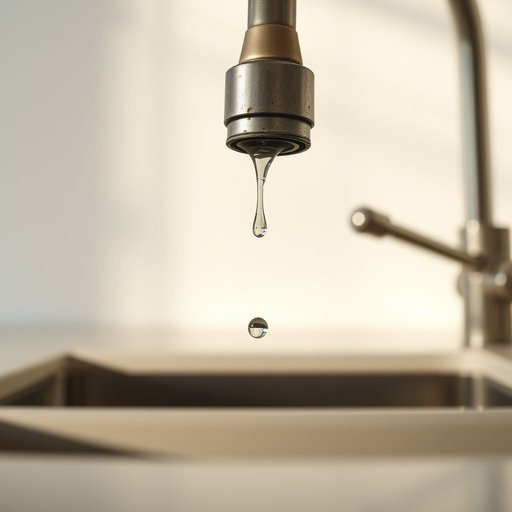

# washer

<h1 style="font-size: 2.5em; font-weight: 300; letter-spacing: 2px; margin: 0; color: #2c3e50;">
/ˈwɑʃər/
</h1>

---

---

## 例句

I noticed that the washer in the kitchen tap has worn out over time, causing a persistent drip that not only wastes water but also creates an annoying background noise whenever someone uses the sink.

*I(/aɪ/) noticed(/ˈnoʊtɪst/) that(/ðət/) the(/ðə/) washer(/ˈwɑʃər/) in(/ɪn/) the(/ðə/) kitchen(/ˈkɪʧən/) tap(/tæp/) has(/həz/) worn(/wɔrn/) out(/aʊt/) over(/ˈoʊvər/) time,(/taɪm,/) causing(/ˈkɔzɪŋ/) a(/ə/) persistent(/pərˈsɪstənt/) drip(/drɪp/) that(/ðət/) not(/nɑt/) only(/ˈoʊnli/) wastes(/weɪsts/) water(/ˈwɔtər/) but(/bət/) also(/ˈɔlsoʊ/) creates(/kriˈeɪts/) an(/ən/) annoying(/əˈnɔɪɪŋ/) background(/ˈbækˌgraʊnd/) noise(/nɔɪz/) whenever(/wɛˈnɛvər/) someone(/ˈsəmˌwən/) uses(/ˈjuzɪz/) the(/ðə/) sink.(/sɪŋk./)*

**翻译：** 我注意到厨房水龙头的垫圈随着时间的推移已经磨损，导致水滴不断，不仅浪费水资源，还在有人使用水槽时产生令人烦躁的背景噪音。

---

## 解释

英语单词“washer”在家居生活用品的语境中作为名词，主要指的是洗衣机，即用于清洗衣物的家用电器，具体使用场合通常出现在日常生活中谈论家务劳动、家庭电器设备或洗衣间时，如“I need to buy a new washer because the old one is broken”（我需要买一台新的洗衣机，因为旧的坏了），学习者在使用“washer”时应注意其单数和复数形式“washers”，以及常见搭配如“washing machine”、“clothes washer”，其中“washer”虽然可以单独使用，但“washing machine”更正式和明确，此外，需注意“washer”也有其他义项，如机械零件中的垫圈，这可能导致理解混淆，因此语境判断尤为重要，词源方面，“washer”源自动词“wash”的派生名词形式，起初指能够进行清洗动作的设备或物品，19世纪工业革命后家用洗衣机普及，逐渐成为指家用洗衣机的固定词汇，在中文中，“washer”根据语境最准确的翻译为洗衣机，而非泛指洗涤用品或清洗工具，若在机械领域则可能译为垫圈，所以理解时需结合具体场合，在普通家居用语中，“washer”无特殊褒贬色彩，属于中性词汇，反映生活便利化的家电产品，是现代家庭生活的常见必备品。

---

<small style="color: #999; font-size: 0.9em;">2025-07-17 06:22:41</small>

