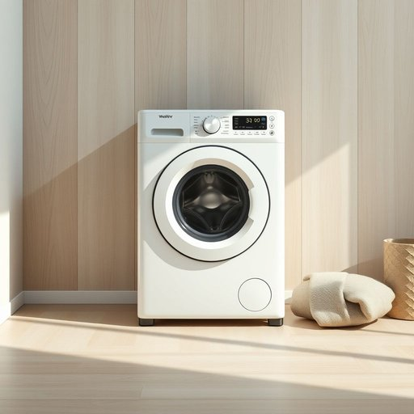

# washing-machine

<h1 style="font-size: 2.5em; font-weight: 300; letter-spacing: 2px; margin: 0; color: #2c3e50;">
/washing-machine*/
</h1>

---

---

## 例句

Although the washing-machine, which we recently bought because the old one kept breaking down and leaking water onto the kitchen floor, is quite energy-efficient and has multiple settings for delicate fabrics, I still find it challenging to remember to separate whites from colours properly before starting a load, especially after a long day at work.

*Although(/ˌɔlˈðoʊ/) the(/ðə/) washing-machine,(/washing-machine*,/) which(/wɪʧ/) we(/wi/) recently(/ˈrisəntli/) bought(/bɔt/) because(/bɪˈkəz/) the(/ðə/) old(/oʊld/) one(/wən/) kept(/kɛpt/) breaking(/ˈbreɪkɪŋ/) down(/daʊn/) and(/ənd/) leaking(/ˈlikɪŋ/) water(/ˈwɔtər/) onto(/ˈɔntu/) the(/ðə/) kitchen(/ˈkɪʧən/) floor,(/flɔr,/) is(/ɪz/) quite(/kwaɪt/) energy-efficient(/energy-efficient*/) and(/ənd/) has(/həz/) multiple(/ˈməltəpəl/) settings(/ˈsɛtɪŋz/) for(/fər/) delicate(/ˈdɛləkət/) fabrics,(/ˈfæbrɪks,/) I(/aɪ/) still(/stɪl/) find(/faɪnd/) it(/ɪt/) challenging(/ˈʧælənʤɪŋ/) to(/tɪ/) remember(/rɪˈmɛmbər/) to(/tɪ/) separate(/ˈsɛpərˌeɪt/) whites(/waɪts/) from(/frəm/) colours(/colours*/) properly(/ˈprɑpərli/) before(/ˌbiˈfɔr/) starting(/ˈstɑrtɪŋ/) a(/ə/) load,(/loʊd,/) especially(/əˈspɛʃəli/) after(/ˈæftər/) a(/ə/) long(/lɔŋ/) day(/deɪ/) at(/æt/) work.(/wərk./)*

**翻译：** 虽然我们最近买了这台洗衣机，因为旧的那台老是坏，而且会漏水到厨房地板上，但这台洗衣机相当节能，并且有多种适合精细面料的设置，不过我仍然觉得很难记得在开始洗衣之前，尤其是在忙碌了一整天之后，正确地将白色和颜色衣物分开洗。

---

## 解释

英语单词“washing-machine”作为名词，主要指家用电器中的“洗衣机”，用于清洗衣物，典型使用场合包括家庭生活、家务劳动、家电购物和维修等语境。在英语中，该词通常作可数名词使用，复数形式为“washing-machines”，且常与动词如“use”、“buy”、“repair”搭配，还可与形容词连用，如“automatic washing-machine”表示自动洗衣机。学习者需要注意其词形结构为复合名词，前半部分“washing”作后半部分“machine”的修饰，整体表示用于“洗涤”的“机器”，拼写时需连字符连接，这在表达具体家用设备时较为标准。该词源自“wash”（洗）与“machine”（机器）的合成，反映工业革命后家用机械化的一个重要发展，代表了现代家居生活中便捷清洁方式的普及。在中文语境中准确翻译为“洗衣机”，是指专门用于洗涤衣物的电器设备，理解时侧重其功能性和家用属性，无褒贬或特殊文化内涵，属于中性词汇。整体而言，“washing-machine”作为家居生活用品名称，语言使用相对直接且规范，是英语日常生活中常见且实用的词汇。

---

<small style="color: #999; font-size: 0.9em;">2025-07-17 06:22:41</small>

