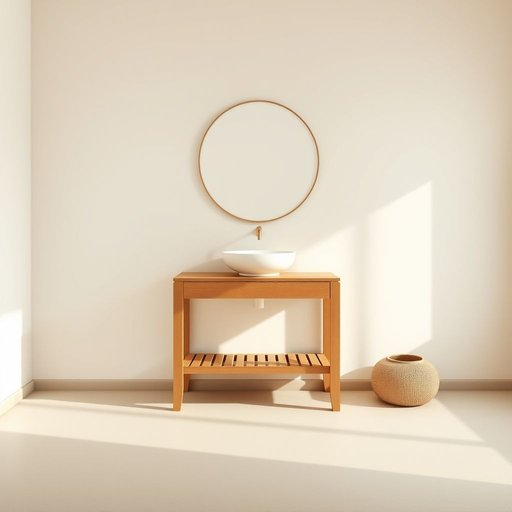

# washstand

<h1 style="font-size: 2.5em; font-weight: 300; letter-spacing: 2px; margin: 0; color: #2c3e50;">
/washstand*/
</h1>

---

---

## 例句

The antique washstand in the guest bedroom, a carefully restored piece featuring an intricately carved wooden frame and a porcelain basin, serves both as a charming focal point and a practical spot for guests to freshen up without needing to use the main bathroom.

*The(/ðə/) antique(/ænˈtik/) washstand(/washstand*/) in(/ɪn/) the(/ðə/) guest(/gɛst/) bedroom,(/ˈbɛˌdrum,/) a(/ə/) carefully(/ˈkɛrfəli/) restored(/rɪˈstɔrd/) piece(/pis/) featuring(/ˈfiʧərɪŋ/) an(/ən/) intricately(/ˈɪntrəkətli/) carved(/kɑrvd/) wooden(/ˈwʊdən/) frame(/freɪm/) and(/ənd/) a(/ə/) porcelain(/ˈpɔrsələn/) basin,(/ˈbeɪsən,/) serves(/sərvz/) both(/boʊθ/) as(/ɛz/) a(/ə/) charming(/ˈʧɑrmɪŋ/) focal(/ˈfoʊkəl/) point(/pɔɪnt/) and(/ənd/) a(/ə/) practical(/ˈpræktɪkəl/) spot(/spɑt/) for(/fər/) guests(/gɛsts/) to(/tɪ/) freshen(/ˈfrɛʃən/) up(/əp/) without(/wɪˈθaʊt/) needing(/ˈnidɪŋ/) to(/tɪ/) use(/juz/) the(/ðə/) main(/meɪn/) bathroom.(/ˈbæθˌrum./)*

**翻译：** 客卧中的古董盥洗台经过精心修复，配有雕工细致的木质框架和瓷制盆，不仅成为一处别致的亮点，也为客人提供了一个便捷的清洗空间，无需使用主浴室。

---

## 解释

washstand作为名词，指的是一种传统的家居生活用品，通常是带有水盆和水壶的置洗台，用于洗手和面部清洁，尤其在没有固定洗手间或自来水设施较早期的家庭环境中常见。这种家具一般置于卧室、客厅一角或浴室前部，便于日常个人卫生使用。英语学习者使用washstand时需注意其作为可数名词的用法，通常单数和复数形式分别为washstand和washstands，常见搭配如antique washstand（古董洗脸台）、wooden washstand（木制洗脸台）或washstand cabinet（带储物柜的洗脸台），此外，它常与水盆(basin)、水壶(ewer)等词语连用。语法上，washstand多用作物主关系或定语，如the washstand’s basin或a washstand with a mirror。词源来源于古英语和中古英语中wash（洗）与stand（支架、架子）的组合，形象地反映了它作为洗漱用具支架的功能，是工业革命前家庭生活的重要组成部分。中文中，washstand可准确翻译为洗脸台或置洗台，在现代较少使用，仅在描述传统或复古家具时出现，强调其作为家具的功能和历史背景；它无特殊褒贬色彩，多带有怀旧或古典意味，反映当时生活方式和卫生条件的特点。

---

<small style="color: #999; font-size: 0.9em;">2025-07-17 06:22:41</small>

