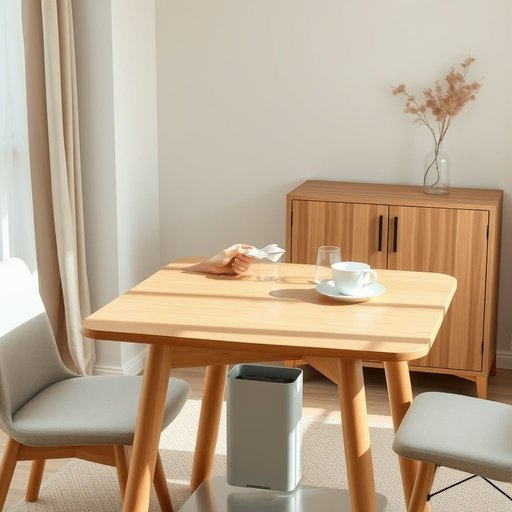

# wastebasket

<h1 style="font-size: 2.5em; font-weight: 300; letter-spacing: 2px; margin: 0; color: #2c3e50;">
/ˈweɪstˌbæskət/
</h1>

---

---

## 例句

After finishing her tea and tidying up the cluttered dining table, she carefully folded the napkin before tossing the used paper into the wastebasket, which was positioned discreetly under the sideboard to keep the room looking neat and uncluttered.

*After(/ˈæftər/) finishing(/ˈfɪnɪʃɪŋ/) her(/hər/) tea(/ti/) and(/ənd/) tidying(/tidying*/) up(/əp/) the(/ðə/) cluttered(/ˈklətərd/) dining(/ˈdaɪnɪŋ/) table,(/ˈteɪbəl,/) she(/ʃi/) carefully(/ˈkɛrfəli/) folded(/ˈfoʊldɪd/) the(/ðə/) napkin(/ˈnæpkɪn/) before(/ˌbiˈfɔr/) tossing(/ˈtɔsɪŋ/) the(/ðə/) used(/juzd/) paper(/ˈpeɪpər/) into(/ˈɪntu/) the(/ðə/) wastebasket,(/ˈweɪstˌbæskət,/) which(/wɪʧ/) was(/wɑz/) positioned(/pəˈzɪʃənd/) discreetly(/dɪˈskritli/) under(/ˈəndər/) the(/ðə/) sideboard(/sideboard*/) to(/tɪ/) keep(/kip/) the(/ðə/) room(/rum/) looking(/ˈlʊkɪŋ/) neat(/nit/) and(/ənd/) uncluttered.(/ənˈklətərd./)*

**翻译：** 喝完茶，整理好杂乱的餐桌后，她小心地叠好餐巾纸，随即将用过的纸巾扔进放在餐边柜下方、隐蔽处的垃圾筐里，以保持房间整洁有序。

---

## 解释

英语单词“wastebasket”作为名词，在家居生活用品语境中指的是用于收集废弃纸张、生活垃圾等的小型容器，通常放置在办公室、书房或家庭生活区，帮助维持环境整洁。使用该词时，英语学习者需要注意其作为可数名词出现时可以用复数形式“wastebaskets”，且常与动词如“empty”（清空）、“fill”（装满）搭配，构成如“empty the wastebasket”（清空废纸篓）的常用表达。另外，wastebasket通常指室内较小、便于携带的垃圾桶，相较于“trash can”或“garbage bin”，范围更局限且多指纸质垃圾。词源方面，“waste”指废弃物，“basket”意为篮子，合成词直观表达“装废物的篮子”，这一名称来源于传统手工编织篮子用于装废弃物的实际生活用品。中文中，wastebasket准确对应“废纸篓”、“废纸篓子”或“垃圾篓”，强调的是室内纸类或轻废弃物收集容器，且无贬义，属于中性实用词汇，通常用于描述日常生活场景，不带有特殊的褒贬或文化隐喻。

---

<small style="color: #999; font-size: 0.9em;">2025-07-17 06:22:41</small>

