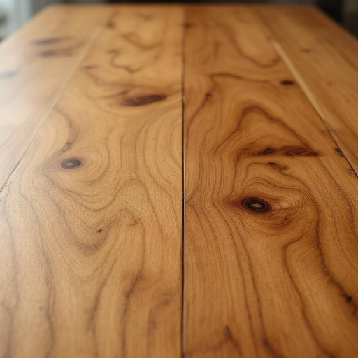

# wax

<h1 style="font-size: 2.5em; font-weight: 300; letter-spacing: 2px; margin: 0; color: #2c3e50;">
/wæks/
</h1>

---

---

## 例句

Before you start polishing the dining table, the wax provides a protective layer that enhances the wood’s natural grain while preventing scratches and spills.

*Before(/ˌbiˈfɔr/) you(/ju/) start(/stɑrt/) polishing(/ˈpɑlɪʃɪŋ/) the(/ðə/) dining(/ˈdaɪnɪŋ/) table,(/ˈteɪbəl,/) the(/ðə/) wax(/wæks/) provides(/prəˈvaɪdz/) a(/ə/) protective(/prəˈtɛktɪv/) layer(/leɪər/) that(/ðət/) enhances(/ɛnˈhænsɪz/) the(/ðə/) wood’s(/wood’s*/) natural(/ˈnæʧərəl/) grain(/greɪn/) while(/waɪl/) preventing(/prɪˈvɛnɪŋ/) scratches(/ˈskræʧɪz/) and(/ənd/) spills.(/spɪlz./)*

**翻译：** 在开始擦拭餐桌之前，蜡层能够形成一层保护膜，不仅突显木材的天然纹理，还能有效防止划痕和液体渗漏。

---

## 解释

英语单词“wax”在家居生活用品领域作为名词，主要指用于抛光、保护或装饰家具、地板等表面的蜡质材料。具体使用场合包括给木质家具或地板上蜡以增加光泽、防止划伤和防潮，也可能用于家具保养膏或打蜡布的描述。学习者在使用“wax”时应注意其作为不可数名词时通常指蜡这种物质本身，而作为可数名词时，较少见，通常指具体形态的蜡块或蜡烛（但在家居用品语境中多指物质）。常见搭配有“furniture wax”（家具蜡）、“floor wax”（地板蜡）、“beeswax”（蜂蜡，常用作天然蜡的代表）等，另外，动词形式“to wax”表示给某物上蜡。词源上，“wax”来源于古英语“weax”，与德语“Wachs”同源，指蜡质物质；这一词根与古代利用蜂蜜生产蜂蜡、以及动物分泌的蜡质物有关，体现了该物质的自然起源。在中文语境中，准确翻译为“蜡”，尤其指用于家具或地板护理的蜡质材料，理解时应侧重于其保护和装饰功能，避免误解为蜡烛或美容用蜡等。该词本身无褒贬含义，文化内涵主要与家居保养和传统手工艺相关，使用时需要根据具体上下文明确范围。

---

<small style="color: #999; font-size: 0.9em;">2025-07-17 06:22:41</small>

