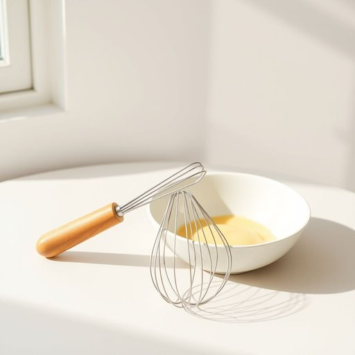

# whisk

<h1 style="font-size: 2.5em; font-weight: 300; letter-spacing: 2px; margin: 0; color: #2c3e50;">
/wɪsk/
</h1>

---

---

## 例句

Could you please pass me the whisk that’s on the counter next to the mixing bowls, the one with the wooden handle and stainless steel wires, because I need to beat the eggs thoroughly before folding them into the batter to ensure the cake has the perfect light and airy texture?

*Could(/kʊd/) you(/ju/) please(/pliz/) pass(/pæs/) me(/mi/) the(/ðə/) whisk(/wɪsk/) that’s(/that’s*/) on(/ɔn/) the(/ðə/) counter(/ˈkaʊntər/) next(/nɛkst/) to(/tɪ/) the(/ðə/) mixing(/ˈmɪksɪŋ/) bowls,(/boʊlz,/) the(/ðə/) one(/wən/) with(/wɪθ/) the(/ðə/) wooden(/ˈwʊdən/) handle(/ˈhændəl/) and(/ənd/) stainless(/ˈsteɪnləs/) steel(/stil/) wires,(/waɪərz,/) because(/bɪˈkəz/) I(/aɪ/) need(/nid/) to(/tɪ/) beat(/bit/) the(/ðə/) eggs(/ɛgz/) thoroughly(/ˈθəroʊli/) before(/ˌbiˈfɔr/) folding(/ˈfoʊldɪŋ/) them(/ðɛm/) into(/ˈɪntu/) the(/ðə/) batter(/ˈbætər/) to(/tɪ/) ensure(/ɪnˈʃʊr/) the(/ðə/) cake(/keɪk/) has(/həz/) the(/ðə/) perfect(/ˈpərˌfɪkt/) light(/laɪt/) and(/ənd/) airy(/ˈɛri/) texture?(/ˈtɛksʧər?/)*

**翻译：** 请把放在搅拌碗旁边柜台上的那个手柄为木质、不锈钢丝制成的打蛋器递给我，因为我需要把鸡蛋充分打散，再轻轻拌入面糊中，以确保蛋糕质地轻盈松软，口感完美。

---

## 解释

英语单词“whisk”作为名词在家居生活用品场景中，主要指的是厨房用具中的打蛋器，即用于搅拌、打发鸡蛋、奶油或其他液体材料的工具，通常由细长的金属丝环组成，便于将空气打入混合物中，使其蓬松。在具体使用场合上，whisk常见于烹饪、烘焙的语境中，比如说“use a whisk to beat the eggs”（用打蛋器打鸡蛋）。英语学习者应注意，“whisk”作为名词时通常不可数，也可数表示具体一把打蛋器，常见的搭配有“wire whisk”（金属丝打蛋器）、“balloon whisk”（气球形打蛋器）等，在语法上多与动词“use”、“hold”、“grab”搭配，表达使用动作。词源方面，“whisk”源自中古英语，原意与迅速移动有关，后引申为快速搅拌的动作，从而得名该厨房用具。中文中准确翻译为“打蛋器”或“搅拌器”，需避免将其误解为“扫帚”或其他风格的“刷子”，因为虽然“whisk”在动词形式有“掸去、迅速挥动”的含义，但作为名词专指厨房搅拌工具，无特殊褒贬色彩，属于中性且实用的家用器具词汇。

---

<small style="color: #999; font-size: 0.9em;">2025-07-17 06:22:41</small>

