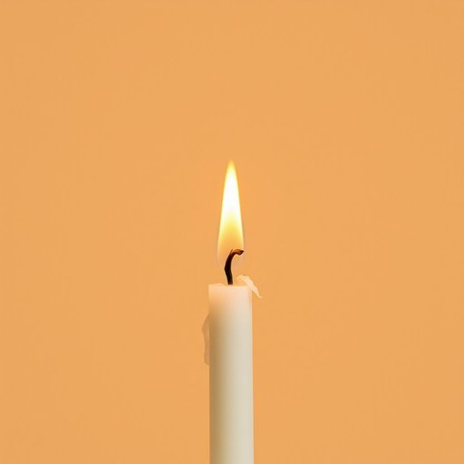

# wick

<h1 style="font-size: 2.5em; font-weight: 300; letter-spacing: 2px; margin: 0; color: #2c3e50;">
/wɪk/
</h1>

---

---

## 例句

Before you light the old lantern, make sure the wick is trimmed evenly and free from any residue, as a poorly maintained wick not only causes uneven burning but can also produce excessive smoke, which might stain the walls in the living room.

*Before(/ˌbiˈfɔr/) you(/ju/) light(/laɪt/) the(/ðə/) old(/oʊld/) lantern,(/ˈlæntərn,/) make(/meɪk/) sure(/ʃʊr/) the(/ðə/) wick(/wɪk/) is(/ɪz/) trimmed(/trɪmd/) evenly(/ˈivənli/) and(/ənd/) free(/fri/) from(/frəm/) any(/ˈɛni/) residue,(/ˈrɛzəˌdu,/) as(/ɛz/) a(/ə/) poorly(/ˈpurli/) maintained(/meɪnˈteɪnd/) wick(/wɪk/) not(/nɑt/) only(/ˈoʊnli/) causes(/ˈkɔzɪz/) uneven(/əˈnivən/) burning(/ˈbərnɪŋ/) but(/bət/) can(/kən/) also(/ˈɔlsoʊ/) produce(/ˈproʊdus/) excessive(/ɪkˈsɛsɪv/) smoke,(/smoʊk,/) which(/wɪʧ/) might(/maɪt/) stain(/steɪn/) the(/ðə/) walls(/wɔlz/) in(/ɪn/) the(/ðə/) living(/ˈlɪvɪŋ/) room.(/rum./)*

**翻译：** 在点燃旧灯笼之前，务必确保灯芯修剪整齐且无任何残留物，因为保养不当的灯芯不仅会导致燃烧不均，还可能产生过多烟雾，进而弄脏客厅的墙壁。

---

## 解释

wick作为名词在家居生活用品场景中，主要指灯芯或烛芯，是灯、蜡烛、油灯等燃烧装置中吸取燃料并传导火焰的纤维部分。具体使用场合多见于描述点燃蜡烛、油灯、香薰灯等需要用火的物品，比如candle wick（蜡烛芯）、lamp wick（灯芯）。英语学习者使用该词时应注意其数的变化，单数为wick，复数为wicks，常用搭配包括trim the wick（修剪灯芯）和light the wick（点燃灯芯），这些表达技巧有助于准确描述灯芯的维护与使用，且wick一般是可数名词。此外，wick来源于古英语单词wice，意指柔软而纤细的材料，演变至今一般指用于引燃火焰的棉纱或纤维束。在中文语境中，wick准确翻译为灯芯或烛芯，强调其在燃烧过程中的导火和吸油作用，没有褒贬色彩，也无特殊文化含义，属于日常生活中具体而实用的物品名称。

---

<small style="color: #999; font-size: 0.9em;">2025-07-17 06:22:41</small>

