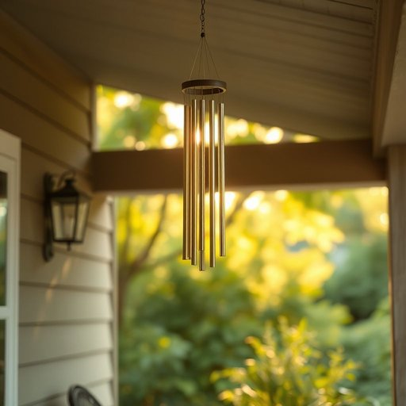

# windchime

<h1 style="font-size: 2.5em; font-weight: 300; letter-spacing: 2px; margin: 0; color: #2c3e50;">
/ˈwɪnˌdʧaɪm/
</h1>

---

---

## 例句

I couldn’t help but overhear their conversation about the windchime hanging on the porch and how its soothing sound reminded them of peaceful summer evenings spent with family.

*I(/aɪ/) couldn’t(/couldn’t*/) help(/hɛlp/) but(/bət/) overhear(/ˈoʊvərˈhir/) their(/ðɛr/) conversation(/ˌkɑnvərˈseɪʃən/) about(/əˈbaʊt/) the(/ðə/) windchime(/ˈwɪnˌdʧaɪm/) hanging(/ˈhæŋɪŋ/) on(/ɔn/) the(/ðə/) porch(/pɔrʧ/) and(/ənd/) how(/haʊ/) its(/ɪts/) soothing(/ˈsuðɪŋ/) sound(/saʊnd/) reminded(/riˈmaɪndɪd/) them(/ðɛm/) of(/əv/) peaceful(/ˈpisfəl/) summer(/ˈsəmər/) evenings(/ˈivnɪŋz/) spent(/spɛnt/) with(/wɪθ/) family.(/ˈfæməli./)*

**翻译：** 我不禁听到了他们关于门廊上风铃的谈话，那风铃悦耳的声音让他们想起了与家人共度的宁静夏夜。

---

## 解释

单词“windchime”作为名词，指的是一种通常悬挂在门廊、窗户、阳台或花园等处，利用风吹动产生悦耳声响的装饰性物品，属于家居生活用品范畴。在具体使用场合和语境中，“windchime”多用于描述环境布置、家居装饰或庭院美化相关的话题，常见于日常对话、购物、旅游或园艺相关的文章和交流中。英语学习者使用“windchime”时应注意该词是可数名词，复数形式为“windchimes”，且常与动词短语如“hang a windchime”（挂一个风铃）、“listen to the windchime”（听风铃声）、“decorate with windchimes”（用风铃装饰）等搭配，表达自然环境的宁静、美好氛围。此外，作为复合词，wind表示“风”，chime指“钟声、响声”，两者合成一个表示“风中发声的装饰物”，强调声音与风的关系。该词起源于英语中“wind”（风）与“chime”（钟声、铃声）组合而成，反映的是利用自然风力产生悦耳声音的装饰品，这种习惯和物品在多文化中均有出现，但在英语中“windchime”这一词形和用法较为固定。在中文语境中，windchime通常被准确翻译为“风铃”，不仅指物理上悬挂的装饰品，也常带有一种静谧、祥和、自然美的文化内涵，不带有明显褒贬色彩，属于积极、温馨的家居装饰象征。综上，“windchime”作为家居生活用品名词，既强调其实用装饰性，也体现了它与自然环境声音美学的结合，是学习和生活中一个具体且富有文化意味的词汇。

---

<small style="color: #999; font-size: 0.9em;">2025-07-17 06:22:41</small>

