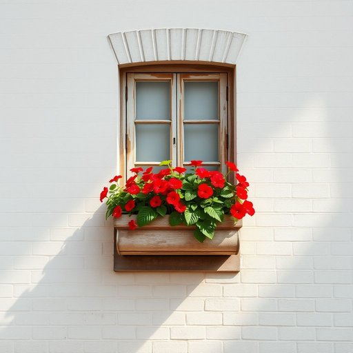

# window-box

<h1 style="font-size: 2.5em; font-weight: 300; letter-spacing: 2px; margin: 0; color: #2c3e50;">
/window-box*/
</h1>

---

---

## 例句

Despite the weathered appearance of the window-box, the vibrant geraniums planted within it continue to thrive, proving that the geraniums' resilience adds a charming splash of color to the otherwise plain brick exterior of our home.

*Despite(/dɪˈspaɪt/) the(/ðə/) weathered(/ˈwɛðərd/) appearance(/əˈpɪrəns/) of(/əv/) the(/ðə/) window-box,(/window-box*,/) the(/ðə/) vibrant(/ˈvaɪbrənt/) geraniums(/ʤərˈeɪniəmz/) planted(/ˈplænɪd/) within(/wɪˈθɪn/) it(/ɪt/) continue(/kənˈtɪnju/) to(/tɪ/) thrive,(/θraɪv,/) proving(/ˈpruvɪŋ/) that(/ðət/) the(/ðə/) geraniums'(/ʤərˈeɪniəmz'/) resilience(/rɪˈzɪljəns/) adds(/ædz/) a(/ə/) charming(/ˈʧɑrmɪŋ/) splash(/splæʃ/) of(/əv/) color(/ˈkələr/) to(/tɪ/) the(/ðə/) otherwise(/ˈəðərˌwaɪz/) plain(/pleɪn/) brick(/brɪk/) exterior(/ɪkˈstɪriər/) of(/əv/) our(/ɑr/) home.(/hoʊm./)*

**翻译：** 尽管窗盒显得风化斑驳，里面种植的鲜艳天竺葵依然茁壮成长，证明了天竺葵的坚韧不拔，为我们家那单调的砖墙外观增添了一抹迷人的色彩。

---

## 解释

“window-box”作为名词，主要指一种安装在窗台外侧的花盆盒或种植箱，常用于家庭或城市住宅中种植花草，使窗台空间得到美化，增加绿色景观，具有装饰和实用双重功能。具体使用场合多见于描述室内外园艺、阳台布置或家居装饰时，如“She placed colorful flowers in the window-box”表示某人把色彩丰富的花放入窗台花箱。英语学习者需要注意的是，“window-box”通常作为复合名词使用，习惯上连写或用连字符连接，且多为可数名词，复数形式为“window-boxes”。在搭配上常见表达包括“plant a window-box”（种植花箱）、“hang a window-box on the sill”（挂在窗台上的花箱）、“window-box garden”（窗台花园）等，使用时通常与动词“plant”, “fill”, “hang”等搭配较多。词源方面，“window-box”由“window”（窗户）和“box”（盒子、箱子）构成，直指安装在窗户外侧的种植盒，起源于欧美家庭园艺文化，尤其盛行于城市公寓和街道房屋，这种设计方便都市居民利用有限空间种植植物。中文语境中，“window-box”常准确译为“窗台花箱”或“窗台花盆”，强调其既是花盆也是安装在窗户边缘的特殊容器，方便理解为“置于窗外的种植箱”。这一词汇无特殊褒贬含义，属于中性词汇，但因其具有美化环境的功能，常带有积极的文化内涵，象征生活情趣和爱护自然的家庭氛围。

---

<small style="color: #999; font-size: 0.9em;">2025-07-17 06:22:41</small>

