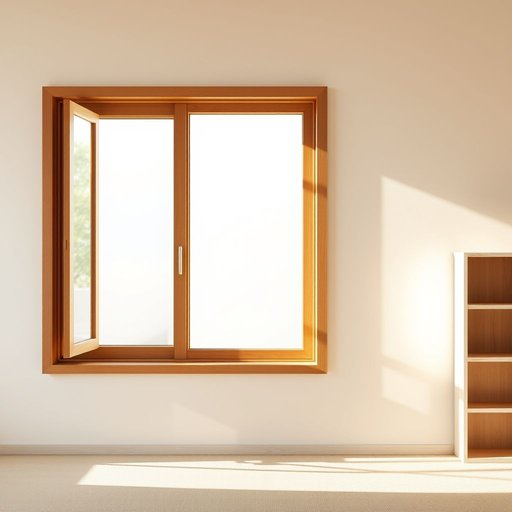

# window

<h1 style="font-size: 2.5em; font-weight: 300; letter-spacing: 2px; margin: 0; color: #2c3e50;">
/ˈwɪndoʊ/
</h1>

---

---

## 例句

Could you please open the window in the living room, the one next to the bookshelf with the chipped paint, because the window’s ventilation is necessary to alleviate the stuffy atmosphere while we arrange the furniture?

*Could(/kʊd/) you(/ju/) please(/pliz/) open(/ˈoʊpən/) the(/ðə/) window(/ˈwɪndoʊ/) in(/ɪn/) the(/ðə/) living(/ˈlɪvɪŋ/) room,(/rum,/) the(/ðə/) one(/wən/) next(/nɛkst/) to(/tɪ/) the(/ðə/) bookshelf(/ˈbʊkˌʃɛlf/) with(/wɪθ/) the(/ðə/) chipped(/ʧɪpt/) paint,(/peɪnt,/) because(/bɪˈkəz/) the(/ðə/) window’s(/window’s*/) ventilation(/ˌvɛntɪˈleɪʃən/) is(/ɪz/) necessary(/ˈnɛsəˌsɛri/) to(/tɪ/) alleviate(/əˈliviˌeɪt/) the(/ðə/) stuffy(/ˈstəfi/) atmosphere(/ˈætməsˌfɪr/) while(/waɪl/) we(/wi/) arrange(/əreɪnʤ/) the(/ðə/) furniture?(/ˈfərnɪʧər?/)*

**翻译：** 请您帮忙打开客厅靠近书架那扇油漆剥落的窗户，因为在我们布置家具时，通风对于缓解空气闷热非常必要。

---

## 解释

英语单词“window”在家居生活用品的语境中作为名词，主要指建筑物墙壁上的开口，通常装有玻璃，用以采光、通风和观察外部环境，常见于住宅、办公室等场合。英语学习者在使用“window”时应注意其作为可数名词的特点，一般用复数形式“windows”表示多个窗户，且常搭配形容词如“large window”（大窗户）、“bedroom window”（卧室窗户）、介词短语“at the window”（靠窗处）以及动词短语如“look out the window”（朝窗外看）。此外，“window”还可用于比喻表达，如“window of opportunity”（机会之窗），但在家居语境下主要指具体物理结构。词源方面，“window”一词源自古英语“windēage”，意为“风眼”，其中“wind”指风，“ēage”意为眼睛，反映出窗户最初作为通风开口的功能。中文中“window”通常准确翻译为“窗户”或“窗”，强调其作为建筑物的一部分，透光透气的作用。该词本身中性，无褒贬含义，文化上常象征开阔视野或机会，其应用广泛且生活化，使用时注重语境即可。

---

<small style="color: #999; font-size: 0.9em;">2025-07-17 06:22:41</small>

