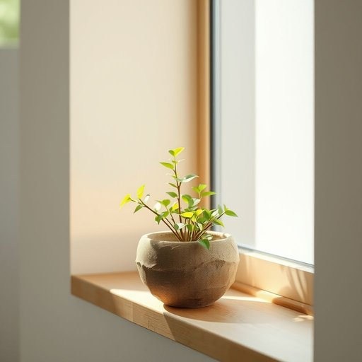

# windowsill

<h1 style="font-size: 2.5em; font-weight: 300; letter-spacing: 2px; margin: 0; color: #2c3e50;">
/windowsill*/
</h1>

---

---

## 例句

The herb in the market, despite its humble appearance, captivated the connoisseurs’ attention due to its unparalleled aroma and the centuries-old cultivation techniques passed down through generations.

*The(/ðə/) herb(/ərb/) in(/ɪn/) the(/ðə/) market,(/ˈmɑrkɪt,/) despite(/dɪˈspaɪt/) its(/ɪts/) humble(/ˈhəmbəl/) appearance,(/əˈpɪrəns,/) captivated(/ˈkæptɪˌveɪtɪd/) the(/ðə/) connoisseurs’(/connoisseurs’*’/) attention(/əˈtɛnʃən/) due(/du/) to(/tɪ/) its(/ɪts/) unparalleled(/ənˈpɛrəˌlɛld/) aroma(/ərˈoʊmə/) and(/ənd/) the(/ðə/) centuries-old(/centuries-old*/) cultivation(/ˌkəltɪˈveɪʃən/) techniques(/tɛkˈniks/) passed(/pæst/) down(/daʊn/) through(/θru/) generations.(/ˌʤɛnərˈeɪʃənz./)*

**翻译：** 市面上的这种草药，虽外表平凡，却因其无与伦比的香气以及代代相传的百年栽培技艺，吸引了鉴赏家的目光。

---

## 解释

windowsill作为名词，指的是窗户下方突出于墙面、用于放置物品或支撑窗框的一条水平窄面板，是家居生活中常见的家居构造部分。具体使用场合通常是在描述室内环境时，如放在windowsill上的花盆、阳光透过窗户照在windowsill上等情景，非常强调它作为窗台的实物存在及其功能。学习者在使用时需注意，windowsill是可数名词，通常指单个窗台，复数形式为windowsills，且通常与介词on搭配使用，如on the windowsill，表示位置关系。常见搭配包括flowerpot on the windowsill（窗台上的花盆）、the morning light on the windowsill（窗台上的晨光）等。在表达技巧上，windowsill常被用作形容具体物品的位置或环境描写的空间语境，帮助细化描述。该词源自古英语window(窗户)和sill(窗槛、底梁)的复合词，sill本身源于古诺尔斯语sil，意为支撑底部的横梁，windowsill作为整体则强调窗户底部的支撑结构及其延伸应用。中文通常翻译为窗台，具有中性且明确的建筑构件含义，在家居语境中无褒贬色彩或特殊文化内涵，纯粹指窗户下部的水平板面，是描述住宅环境时不可或缺的词汇。

---

<small style="color: #999; font-size: 0.9em;">2025-07-17 06:22:41</small>

