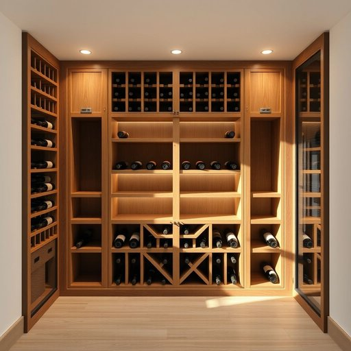

# wine-cellar

<h1 style="font-size: 2.5em; font-weight: 300; letter-spacing: 2px; margin: 0; color: #2c3e50;">
/wine-cellar*/
</h1>

---

---

## 例句

Ever since we renovated the house last year, the wine-cellar, which is tucked beneath the kitchen and features custom oak racks alongside temperature and humidity controls, has become the favourite spot for hosting intimate gatherings where friends can admire the collection and sample bottles from different vintages.

*Ever(/ˈɛvər/) since(/sɪns/) we(/wi/) renovated(/ˈrɛnəˌveɪtɪd/) the(/ðə/) house(/haʊs/) last(/læst/) year,(/jɪr,/) the(/ðə/) wine-cellar,(/wine-cellar*,/) which(/wɪʧ/) is(/ɪz/) tucked(/təkt/) beneath(/bɪˈniθ/) the(/ðə/) kitchen(/ˈkɪʧən/) and(/ənd/) features(/ˈfiʧərz/) custom(/ˈkəstəm/) oak(/oʊk/) racks(/ræks/) alongside(/əˈlɔŋˈsaɪd/) temperature(/ˈtɛmpərəʧər/) and(/ənd/) humidity(/hjuˈmɪdəti/) controls,(/kənˈtroʊlz,/) has(/həz/) become(/bɪˈkəm/) the(/ðə/) favourite(/ˈfeɪvərɪt/) spot(/spɑt/) for(/fər/) hosting(/ˈhoʊstɪŋ/) intimate(/ˈɪnɪmət/) gatherings(/ˈgæðərɪŋz/) where(/wɛr/) friends(/frɛndz/) can(/kən/) admire(/ædˈmaɪr/) the(/ðə/) collection(/kəˈlɛkʃən/) and(/ənd/) sample(/ˈsæmpəl/) bottles(/ˈbɑtəlz/) from(/frəm/) different(/ˈdɪfərənt/) vintages.(/ˈvɪntɪʤɪz./)*

**翻译：** 自从去年我们翻修了房子后，酒窖便成了最受欢迎的聚会场所。酒窖隐匿于厨房下方，配备了定制的橡木酒架以及温度和湿度控制系统，朋友们可以在这里欣赏藏酒，品尝不同年份的佳酿，享受亲密而雅致的聚会时光。

---

## 解释

“wine-cellar”作为名词，指的是专门用来储存葡萄酒的地下室或酒窖，通常出现在家居生活用品的语境中，尤其是涉及葡萄酒收藏、家庭酒吧或专业储酒环境时。具体使用场合多为描述家庭装修、酒类存储条件或酒窖设计，如“a temperature-controlled wine-cellar”表示恒温酒窖。在语法上，“wine-cellar”一般作可数名词使用，复数形式为“wine-cellars”，通常前面可加限定词如“the”，“a”或数量词。该词常与形容词连用，如“spacious wine-cellar”（宽敞的酒窖）、“underground wine-cellar”（地下酒窖），也常见于复合表达中，如“wine-cellar door”（酒窖门）。学习者需注意其构成，“wine”作定语修饰“cellar”，两个单词连写或以连字符连接均可，但连字符形式更常见且规范。词源上，“wine”源自古英语“wīn”，借自拉丁语“vinum”（葡萄酒），而“cellar”来源于拉丁语“cellarium”，意为储藏室，因此组合而成的“wine-cellar”指专门储存葡萄酒的空间。在中文语境中，“wine-cellar”准确翻译为“酒窖”，强调其作为酒类存储的专用空间，与普通地下室不同，突出恒温、遮光、通风良好的特点，便于葡萄酒的长时间保存。值得注意的是，这一词汇本身不带褒义或贬义，但在文化上常与品味、收藏、享受生活等正面形象相关联，属于较为正式且专业的用语，适合用于描述高品质家居环境或葡萄酒文化场景。

---

<small style="color: #999; font-size: 0.9em;">2025-07-17 06:22:41</small>

