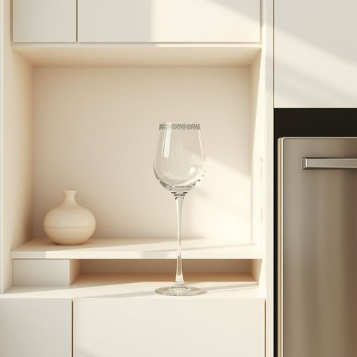

# wine-glass

<h1 style="font-size: 2.5em; font-weight: 300; letter-spacing: 2px; margin: 0; color: #2c3e50;">
/wine-glass*/
</h1>

---

---

## 例句

Could you please bring me the wine-glass that’s tucked away in the cabinet next to the dishwasher, the one with the delicate etched pattern around the rim that we only use for special occasions or when we have guests over on the weekend?

*Could(/kʊd/) you(/ju/) please(/pliz/) bring(/brɪŋ/) me(/mi/) the(/ðə/) wine-glass(/wine-glass*/) that’s(/that’s*/) tucked(/təkt/) away(/əˈweɪ/) in(/ɪn/) the(/ðə/) cabinet(/ˈkæbənət/) next(/nɛkst/) to(/tɪ/) the(/ðə/) dishwasher,(/ˈdɪʃˌwɑʃər,/) the(/ðə/) one(/wən/) with(/wɪθ/) the(/ðə/) delicate(/ˈdɛləkət/) etched(/ɛʧt/) pattern(/ˈpætərn/) around(/əraʊnd/) the(/ðə/) rim(/rɪm/) that(/ðət/) we(/wi/) only(/ˈoʊnli/) use(/juz/) for(/fər/) special(/ˈspɛʃəl/) occasions(/ɔˈkeɪʒənz/) or(/ər/) when(/wɪn/) we(/wi/) have(/hæv/) guests(/gɛsts/) over(/ˈoʊvər/) on(/ɔn/) the(/ðə/) weekend?(/ˈwiˌkɪnd?/)*

**翻译：** 请你帮我拿一下藏在洗碗机旁边橱柜里的那个酒杯，就是那个杯口周围有精致雕花图案的酒杯，我们只在特别的场合或者周末有客人来的时候才会用它。

---

## 解释

英语单词“wine-glass”作为名词，在家居生活用品场景中指的是专门用来饮用葡萄酒的玻璃器皿，通常具有一个较长的杯脚和一个宽口的杯碗，适合盛装不同类型的葡萄酒，如红葡萄酒或白葡萄酒。使用场合多见于餐桌布置、餐厅、酒吧或家庭聚会中，强调饮酒礼仪和品酒体验。英语学习者在使用“wine-glass”时应注意其复合名词结构，通常作为可数名词出现，复数形式为“wine-glasses”，且可与形容词搭配如“elegant wine-glass”、“crystal wine-glass”或与动词搭配如“to hold a wine-glass”。此外，表达时常见固定搭配包括“set of wine-glasses”（一套餐具）和“break a wine-glass”（打破酒杯）。词源方面，“wine-glass”由“wine”（葡萄酒）和“glass”（玻璃杯）组合而成，体现其直接的功能属性，起源于葡萄酒饮用文化的发展。中文语境中准确译为“酒杯”或“葡萄酒杯”，强调其专门为葡萄酒设计的特点，区别于一般的“杯子”或“玻璃杯”。此词汇通常中性，无明显褒贬色彩，但在文化内涵上体现了一定的优雅和礼仪感，常用于正式或注重饮酒体验的环境描述，了解这些细节有助于英语学习者更准确、地道地使用和理解“wine-glass”。

---

<small style="color: #999; font-size: 0.9em;">2025-07-17 06:22:41</small>

