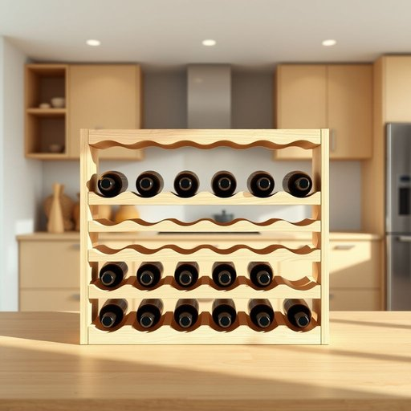

# wine-rack

<h1 style="font-size: 2.5em; font-weight: 300; letter-spacing: 2px; margin: 0; color: #2c3e50;">
/wine-rack*/
</h1>

---

---

## 例句

The refurbishment of the kitchen included a meticulously designed wine-rack that serves as both a functional and aesthetic centerpiece, demonstrating that a wine-rack can be as much a statement piece as a practical storage solution.

*The(/ðə/) refurbishment(/riˈfərbɪʃmənt/) of(/əv/) the(/ðə/) kitchen(/ˈkɪʧən/) included(/ˌɪnˈkludɪd/) a(/ə/) meticulously(/məˈtɪkjələsli/) designed(/dɪˈzaɪnd/) wine-rack(/wine-rack*/) that(/ðət/) serves(/sərvz/) as(/ɛz/) both(/boʊθ/) a(/ə/) functional(/ˈfəŋkʃənəl/) and(/ənd/) aesthetic(/ɛsˈθɛtɪk/) centerpiece,(/ˈsɛntərˌpis,/) demonstrating(/ˈdɛmənˌstreɪtɪŋ/) that(/ðət/) a(/ə/) wine-rack(/wine-rack*/) can(/kən/) be(/bi/) as(/ɛz/) much(/məʧ/) a(/ə/) statement(/ˈsteɪtmənt/) piece(/pis/) as(/ɛz/) a(/ə/) practical(/ˈpræktɪkəl/) storage(/ˈstɔrɪʤ/) solution.(/səˈluʃən./)*

**翻译：** 厨房的翻修包含了一个精心设计的酒架，既具实用功能，又成为美观的视觉焦点，充分展示了酒架不仅是实用的储藏工具，更能作为引人注目的装饰精品。

---

## 解释

“wine-rack”作为名词在家居生活用品的语境中指的是用于储存或陈列葡萄酒瓶的架子，通常设计有多个隔间或槽位以确保酒瓶水平放置，帮助保存酒质。具体使用场合多见于厨房、餐厅、酒窖或酒吧等场所，常用于描述家居布置或餐饮环境中的收纳工具。英语学习者使用该词时需注意其复合名词结构，通常为“wine”和“rack”两个名词组合，作单数或复数时形式分别为“wine-rack”和“wine-racks”，且前面的“wine”作定语修饰“rack”，不需加复数。常见搭配包括“wooden wine-rack”（木质酒架）、“wall-mounted wine-rack”（壁挂式酒架）以及“wine-rack storage”（酒架储存），表达时可结合这些形容词提高准确度和丰富度。词源上，“wine-rack”由“wine”（葡萄酒）和“rack”（架子、支架）组成，二者均源自古英语，反映了将酒瓶放置于专用架中的实用需求。中文中通常翻译为“酒架”或“酒瓶架”，是居家生活中用来合理收纳和展示葡萄酒的工具，理解时要注意其功能属性和家居用品类别的关联，属于中性词汇，无特殊褒贬色彩，也无特别文化内涵，主要体现生活品质和储存便利性的理念。

---

<small style="color: #999; font-size: 0.9em;">2025-07-17 06:22:41</small>

