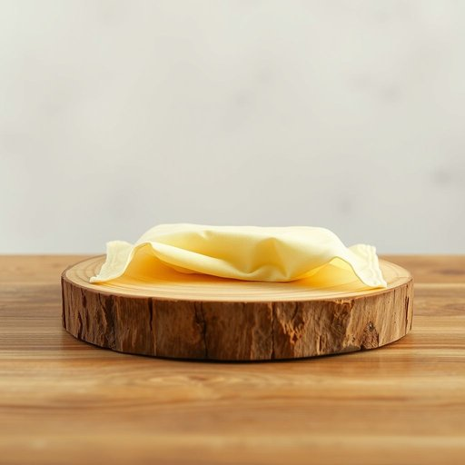

# wipe

<h1 style="font-size: 2.5em; font-weight: 300; letter-spacing: 2px; margin: 0; color: #2c3e50;">
/waɪp/
</h1>

---

---

## 例句

The wipe, carefully infused with lemon scent and designed to be both antibacterial and gentle on wooden surfaces, proved indispensable when she needed to quickly clean up the spill before it left a stain.

*The(/ðə/) wipe,(/waɪp,/) carefully(/ˈkɛrfəli/) infused(/ˌɪnfˈjuzd/) with(/wɪθ/) lemon(/ˈlɛmən/) scent(/sɛnt/) and(/ənd/) designed(/dɪˈzaɪnd/) to(/tɪ/) be(/bi/) both(/boʊθ/) antibacterial(/ˌæntibækˈtɪriəl/) and(/ənd/) gentle(/ˈʤɛnəl/) on(/ɔn/) wooden(/ˈwʊdən/) surfaces,(/ˈsərfəsɪz,/) proved(/pruvd/) indispensable(/ˌɪndɪˈspɛnsəbəl/) when(/wɪn/) she(/ʃi/) needed(/ˈnidɪd/) to(/tɪ/) quickly(/kˈwɪkli/) clean(/klin/) up(/əp/) the(/ðə/) spill(/spɪl/) before(/ˌbiˈfɔr/) it(/ɪt/) left(/lɛft/) a(/ə/) stain.(/steɪn./)*

**翻译：** 这块擦巾经过精心注入柠檬香气，既具备抗菌功能，又对木质表面温和，在她需要迅速清理溢出物、防止留下污渍时显得尤为必不可少。

---

## 解释

英语单词“wipe”作为名词在家居生活用品的语境中，通常指用于擦拭或清洁表面的湿巾、抹布或一次性清洁布，常见于厨房、浴室或清洁工作中，比如“baby wipe”（婴儿湿巾）、“cleaning wipe”（清洁湿巾）等。学习者使用“wipe”作为名词时应注意其单复数形式“wipes”，且通常前面会有形容词限定其用途或材质，如“disinfectant wipe”（消毒湿巾），此外，“wipe”作为名词多用于可数名词，指单张或单件物品；语法上不能直接作动词使用，但可与动词“use”、“grab”、“throw away”等搭配表示操作动作。词源上，“wipe”源自古英语“wīpian”，意为擦拭或清洁，随着生活用品的发展衍生出表示用来擦拭的工具的名词意义。在中文语境中，“wipe”作为家居生活用品名词时准确翻译为“湿巾”或“擦拭布”，强调其清洁和便捷的功能，没有褒贬色彩，属于中性词，且在现代家庭清洁和个人护理中具有普遍使用价值，反映了卫生习惯和生活便利性。

---

<small style="color: #999; font-size: 0.9em;">2025-07-17 06:22:41</small>

