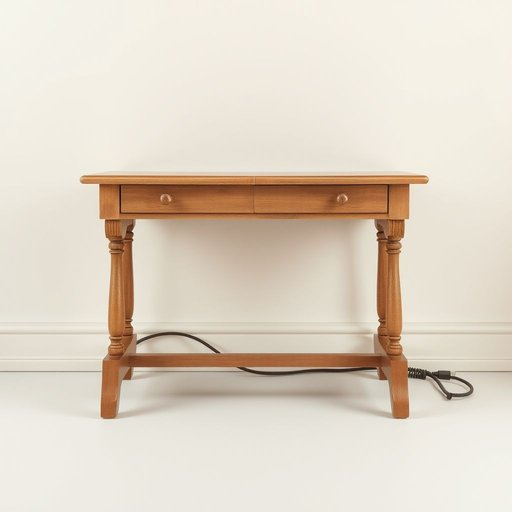

# wire

<h1 style="font-size: 2.5em; font-weight: 300; letter-spacing: 2px; margin: 0; color: #2c3e50;">
/waɪər/
</h1>

---

---

## 例句

The lamp on the antique desk, whose intricate wire was frayed and hidden behind the skirting board, required a proper toolkit and patience for a safe replacement.

*The(/ðə/) lamp(/læmp/) on(/ɔn/) the(/ðə/) antique(/ænˈtik/) desk,(/dɛsk,/) whose(/huz/) intricate(/ˈɪntrəkət/) wire(/waɪər/) was(/wɑz/) frayed(/freɪd/) and(/ənd/) hidden(/ˈhɪdən/) behind(/bɪˈhaɪnd/) the(/ðə/) skirting(/ˈskərtɪŋ/) board,(/bɔrd,/) required(/rikˈwaɪərd/) a(/ə/) proper(/ˈprɑpər/) toolkit(/toolkit*/) and(/ənd/) patience(/ˈpeɪʃəns/) for(/fər/) a(/ə/) safe(/seɪf/) replacement.(/rɪˈpleɪsmənt./)*

**翻译：** 那盏放在古董书桌上的台灯，其复杂的电线已经磨损且藏于踢脚板后面，需用合适的工具和耐心方能安全更换。

---

## 解释

英语单词“wire”在家居生活用品的语境中，作为名词主要指金属制成的细长条状物，通常用于电线、绳索、框架等。例如，家中的电器连接线、电灯电线或窗帘拉绳中的钢丝都可以称为wire。使用时，学习者应注意“wire”属于可数名词，可以用复数形式“wires”，且通常可与形容词连用，如“electric wire”（电线）、“copper wire”（铜线）或“thin wire”（细铁丝）。常见搭配还有“wire insulation”（电线绝缘层）、“wire cutter”（钢丝钳）等。在语法上，“wire”作为名词可以作主语、宾语或宾语补足语，且常出现在固定短语如“run wire”（布线）、“cut the wire”（剪断电线）中。词源上，“wire”源自古英语“wīr”，其根源可追溯至日耳曼语族，意指细长金属线材，体现了其基本物理形态和功能属性。中文语境中，“wire”通常准确翻译为“线”“电线”或“钢丝”，需要根据具体材质和用途区别，如“电线”强调其传导电流的功能，“钢丝”强调其强度和物理形态。该词本身无明显褒贬色彩，属于中性词汇，但在文化语境中，“to be wired”有时可以引申为“神经紧张、非常兴奋”，属于俚语用法，需注意区别。综上，学习者在家庭生活场合使用“wire”时，应结合具体物品的材料和功能准确理解并灵活搭配，从而精准表达。

---

<small style="color: #999; font-size: 0.9em;">2025-07-17 06:22:41</small>

