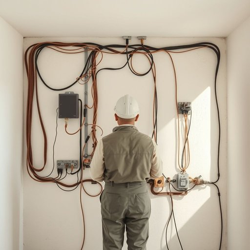

# wiring

<h1 style="font-size: 2.5em; font-weight: 300; letter-spacing: 2px; margin: 0; color: #2c3e50;">
/ˈwaɪrɪŋ/
</h1>

---

---

## 例句

Before the renovation, the electrician’s assessment of the wiring revealed significant risks despite its hidden and seemingly intact condition.

*Before(/ˌbiˈfɔr/) the(/ðə/) renovation,(/ˌrɛnəˈveɪʃən,/) the(/ðə/) electrician’s(/electrician’s*/) assessment(/əˈsɛsmənt/) of(/əv/) the(/ðə/) wiring(/ˈwaɪrɪŋ/) revealed(/rɪˈvild/) significant(/sɪgˈnɪfɪkənt/) risks(/rɪsks/) despite(/dɪˈspaɪt/) its(/ɪts/) hidden(/ˈhɪdən/) and(/ənd/) seemingly(/ˈsimɪŋli/) intact(/ˌɪnˈtækt/) condition.(/kənˈdɪʃən./)*

**翻译：** 翻修前，电工对线路的评估显示，尽管线路隐藏且外观完好，但存在重大安全隐患。

---

## 解释

wiring作为名词在家居生活用品的语境中，通常指建筑或房屋内电线系统的整体布局和安装，用以传输电力或信号，实现照明、家用电器和电子设备的正常运行。具体使用场合多见于讨论电气安装、电路布线、家庭装修或维修时，例如house wiring（房屋布线）、faulty wiring（有故障的布线）等。在语法上，wiring是不可数名词，不能直接使用复数形式，常与动词连用构成描述整体系统的句子，也经常与形容词搭配，如modern wiring（现代布线）、old wiring（旧布线）等。英语学习者应注意它虽源于动词wire的动名词形式，但作为名词时专指电线布置系统，并非单根电线。词源上，wire来自中古英语，最早源于古英语wīr，意为金属细线，wiring则指相关的线缆及其安装过程或结构。中文语境中，wiring准确翻译为布线或线路布置，强调电线的系统性配置，是电力和电子设备安全运行的基础。该词在家居领域通常保持中性，无褒贬色彩，但faulty wiring则隐含安全隐患的负面含义，提醒存在危险或需要维修。总体上，wiring作为家居电气系统的专业术语，既实用又具体，理解时应结合电气安全与功能性的背景。

---

<small style="color: #999; font-size: 0.9em;">2025-07-17 06:22:41</small>

