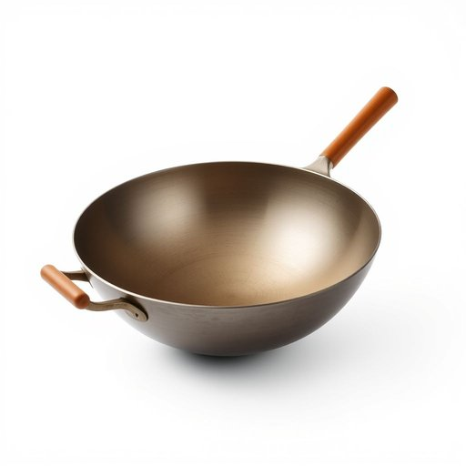

# wok

<h1 style="font-size: 2.5em; font-weight: 300; letter-spacing: 2px; margin: 0; color: #2c3e50;">
/wɑk/
</h1>

---

---

## 例句

After rummaging through the cluttered kitchen cabinet, she finally found the well-seasoned wok, whose wide, curved surface and sturdy handle made it perfectly suited not only for stir-frying vegetables in high heat but also for preparing complex, flavour-packed dishes that reminded her of the bustling street food stalls she adored while travelling in Asia.

*After(/ˈæftər/) rummaging(/ˈrəmɪʤɪŋ/) through(/θru/) the(/ðə/) cluttered(/ˈklətərd/) kitchen(/ˈkɪʧən/) cabinet,(/ˈkæbənət,/) she(/ʃi/) finally(/ˈfaɪnəli/) found(/faʊnd/) the(/ðə/) well-seasoned(/well-seasoned*/) wok,(/wɑk,/) whose(/huz/) wide,(/waɪd,/) curved(/kərvd/) surface(/ˈsərfəs/) and(/ənd/) sturdy(/ˈstərdi/) handle(/ˈhændəl/) made(/meɪd/) it(/ɪt/) perfectly(/ˈpərfəktli/) suited(/ˈsutɪd/) not(/nɑt/) only(/ˈoʊnli/) for(/fər/) stir-frying(/stir-frying*/) vegetables(/ˈvɛʤtəbəlz/) in(/ɪn/) high(/haɪ/) heat(/hit/) but(/bət/) also(/ˈɔlsoʊ/) for(/fər/) preparing(/pərˈpɛrɪŋ/) complex,(/ˈkɑmplɛks,/) flavour-packed(/flavour-packed*/) dishes(/ˈdɪʃɪz/) that(/ðət/) reminded(/riˈmaɪndɪd/) her(/hər/) of(/əv/) the(/ðə/) bustling(/ˈbəsəlɪŋ/) street(/strit/) food(/fud/) stalls(/stɔlz/) she(/ʃi/) adored(/əˈdɔrd/) while(/waɪl/) travelling(/ˈtrævəlɪŋ/) in(/ɪn/) Asia.(/ˈeɪʒə./)*

**翻译：** 在翻找凌乱的厨房橱柜后，她终于找到了那只用得油润的炒锅，宽大弧形的锅身和结实的把手不仅非常适合用大火快炒蔬菜，也能用来烹制那些复杂且风味浓郁的菜肴，让她想起了旅居亚洲时钟爱的人山人海的街头小吃摊。

---

## 解释

英语单词“wok”作为家居生活用品中的名词，指的是一种典型的中式炒锅，具有深圆底和两侧斜高的锅体，常用于炒菜、煎炸、蒸煮等多种烹饪方式，尤其适合快速高温炒制。它通常出现在描述厨房用具或炊具的语境中，例如“cook with a wok”（用炒锅烹饪）。学习者在使用该词时应注意“wok”是可数名词，复数形式为“woks”，且常与动词搭配如“use a wok”、“clean the wok”，或者搭配形容词如“steel wok”（钢制炒锅）、“non-stick wok”（不粘锅）等。同时，“wok”多用于指具体的物品，不用作抽象概念。词源上，“wok”来自粤语拼音“鑊”，反映其源自中国南方的传统烹饪器具，随着中华饮食文化传播而进入英语词汇，基本无褒贬色彩，但带有明显的文化标签，象征中式烹饪的特色工具。在中文语境中，“wok”准确对应“炒锅”，这是一个日常厨具名词，既表明其物理形态（深底锅体），又隐含其功能用途（快炒、爆炒等），因此理解时应结合其文化背景和使用习惯。

---

<small style="color: #999; font-size: 0.9em;">2025-07-17 06:22:41</small>

