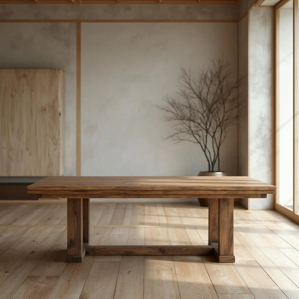

# wood

<h1 style="font-size: 2.5em; font-weight: 300; letter-spacing: 2px; margin: 0; color: #2c3e50;">
/wʊd/
</h1>

---

---

## 例句

The old dining table, crafted from dark oak wood that we salvaged from the barn last summer, not only adds a rustic charm to our kitchen but also serves as a sturdy centerpiece where the whole family gathers every evening to share meals and stories.

*The(/ðə/) old(/oʊld/) dining(/ˈdaɪnɪŋ/) table,(/ˈteɪbəl,/) crafted(/ˈkræftɪd/) from(/frəm/) dark(/dɑrk/) oak(/oʊk/) wood(/wʊd/) that(/ðət/) we(/wi/) salvaged(/ˈsælvɪʤd/) from(/frəm/) the(/ðə/) barn(/bɑrn/) last(/læst/) summer,(/ˈsəmər,/) not(/nɑt/) only(/ˈoʊnli/) adds(/ædz/) a(/ə/) rustic(/ˈrəstɪk/) charm(/ʧɑrm/) to(/tɪ/) our(/ɑr/) kitchen(/ˈkɪʧən/) but(/bət/) also(/ˈɔlsoʊ/) serves(/sərvz/) as(/ɛz/) a(/ə/) sturdy(/ˈstərdi/) centerpiece(/ˈsɛntərˌpis/) where(/wɛr/) the(/ðə/) whole(/hoʊl/) family(/ˈfæməli/) gathers(/ˈgæðərz/) every(/ˈɛvəri/) evening(/ˈivnɪŋ/) to(/tɪ/) share(/ʃɛr/) meals(/milz/) and(/ənd/) stories.(/ˈstɔriz./)*

**翻译：** 那张旧餐桌由我们去年夏天从谷仓中取回的深色橡木制成，不仅为我们的厨房增添了田园风情，也成为坚固的中心，让全家人每晚齐聚于此，共享晚餐与故事。

---

## 解释

单词“wood”作为名词在家居生活用品的语境中，主要指用来制作家具、地板、橱柜或其他家居装饰的木材。具体使用场合通常涉及描述家具的材质，如wooden table（木桌）、wood floor（木地板）等，强调天然的树木材料而非合成品。学习者在使用“wood”时需注意它作为不可数名词时表示木材的整体材质，如“Wood is a durable material.”，也可以作为可数名词指特定种类的木头或木块，如“a piece of wood”。常见搭配包括“wooden furniture”（木制家具）、“hard wood”（硬木）、“soft wood”（软木）、“wood grain”（木纹）等，表达时要避免混淆wood和wooden，后者是形容词，表示“木制的”。“Wood”源自古英语“wudu”，意指树木或森林，反映其作为天然材料的本质。其中文翻译一般为“木材”或“木头”，在家居用品的语境下多译为“木材”，强调作为制造材料的属性，区别于表示“树林、森林”的“wood”即“树林”。在中文理解中，“wood”并无特殊褒贬色彩，但在文化语境中它常象征自然、质朴与耐用性，寓意环保和天然，尤其在现代家居设计中，木材材料常被赋予温馨和舒适的象征意义。

---

<small style="color: #999; font-size: 0.9em;">2025-07-17 06:22:41</small>

