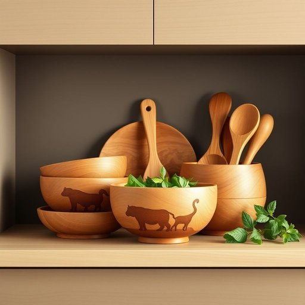

# woodenware

<h1 style="font-size: 2.5em; font-weight: 300; letter-spacing: 2px; margin: 0; color: #2c3e50;">
/woodenware*/
</h1>

---

---

## 例句

After reorganising the kitchen cupboards, I realised that all the woodenware we bought at the craft fair last year, ranging from intricately carved salad bowls to delicate spoon sets, had been neatly stacked on the top shelf, tucked away behind the less frequently used crockery and glassware.

*After(/ˈæftər/) reorganising(/reorganising*/) the(/ðə/) kitchen(/ˈkɪʧən/) cupboards,(/ˈkəbərdz,/) I(/aɪ/) realised(/ˈriəˌlaɪzd/) that(/ðət/) all(/ɔl/) the(/ðə/) woodenware(/woodenware*/) we(/wi/) bought(/bɔt/) at(/æt/) the(/ðə/) craft(/kræft/) fair(/fɛr/) last(/læst/) year,(/jɪr,/) ranging(/ˈreɪnʤɪŋ/) from(/frəm/) intricately(/ˈɪntrəkətli/) carved(/kɑrvd/) salad(/ˈsæləd/) bowls(/boʊlz/) to(/tɪ/) delicate(/ˈdɛləkət/) spoon(/spun/) sets,(/sɛts,/) had(/hæd/) been(/bɪn/) neatly(/ˈnitli/) stacked(/stækt/) on(/ɔn/) the(/ðə/) top(/tɔp/) shelf,(/ʃɛlf,/) tucked(/təkt/) away(/əˈweɪ/) behind(/bɪˈhaɪnd/) the(/ðə/) less(/lɛs/) frequently(/ˈfrikwɛntli/) used(/juzd/) crockery(/ˈkrɑkəri/) and(/ənd/) glassware.(/ˈglæsˌwɛr./)*

**翻译：** 整理完厨房橱柜后，我才发现去年在手工艺品展上购买的所有木制器具——从雕工精美的沙拉碗到精致的勺子套装——都整齐地堆放在顶层搁板上，藏在那些不常用的瓷器和玻璃器皿后面。

---

## 解释

英语单词woodenware作为名词，主要指由木材制成的家庭生活用品，如木制器皿、餐具、器具等，常用于描述厨房用具、餐具、储物盒等在日常生活中的具体物品。在使用场合上，通常出现在家具、家居用品店、室内装饰或工艺品领域的描述中，语境较为正式或专业，日常口语使用较少。英语学习者在使用该词时应注意其作为不可数名词时多指木制品的整体类别，作为可数名词时可指具体的木制器具，其复数形式为woodenwares，但较为少见且多用于商业目录或分类；此外，常见搭配有woodenware products（木制品），woodenware set（木制餐具套装）等。该词来源于wooden（木制的）与ware（器皿、制品）组合而成，ware源自古英语waru，意指商品或器物，整体表达出“木制的器皿或用品”之意。在中文语境中，woodenware准确翻译为“木器”或“木制品”，尤其强调家庭生活中的木制用具，如木碗、木勺、木盘等，因而在相关领域表达时应避免泛泛的“木制品”而更侧重“生活木器”或“木制家居用品”以凸显其具体性。该词整体中性，无褒贬色彩，文化内涵多与传统手工艺和环保自然材料的生活理念相关联，体现一种自然质朴的生活态度。

---

<small style="color: #999; font-size: 0.9em;">2025-07-17 06:22:41</small>

