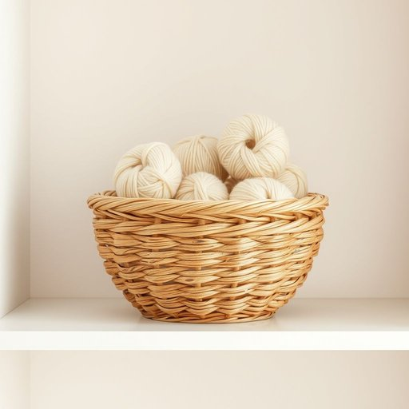

# wool

<h1 style="font-size: 2.5em; font-weight: 300; letter-spacing: 2px; margin: 0; color: #2c3e50;">
/wʊl/
</h1>

---

---

## 例句

Could you please check the knitting basket on the shelf, where I keep the balls of wool—especially the thick, cream-coloured wool that’s perfect for making warm scarves during the chilly winter evenings?

*Could(/kʊd/) you(/ju/) please(/pliz/) check(/ʧɛk/) the(/ðə/) knitting(/ˈnɪtɪŋ/) basket(/ˈbæskət/) on(/ɔn/) the(/ðə/) shelf,(/ʃɛlf,/) where(/wɛr/) I(/aɪ/) keep(/kip/) the(/ðə/) balls(/bɔlz/) of(/əv/) wool—especially(/wool—especially*/) the(/ðə/) thick,(/θɪk,/) cream-coloured(/cream-coloured*/) wool(/wʊl/) that’s(/that’s*/) perfect(/ˈpərˌfɪkt/) for(/fər/) making(/ˈmeɪkɪŋ/) warm(/wɔrm/) scarves(/skɑrvz/) during(/ˈdʊrɪŋ/) the(/ðə/) chilly(/ˈʧɪli/) winter(/ˈwɪntər/) evenings?(/ˈivnɪŋz?/)*

**翻译：** 请您帮忙检查一下架子上的编织篮子，那是我放毛线球的地方，特别是那种质地厚实、奶油色的毛线，非常适合在寒冷的冬夜织暖和的围巾。

---

## 解释

英语单词“wool”作为名词，在家居生活用品的语境中主要指来自绵羊或其他动物身上的天然纤维，常用于制作毯子、毛衣、地毯、靠垫等织物材料，具体使用场合多为描述衣物材质、家居装饰品或保暖用品时。英语学习者在使用“wool”时应注意其不可数名词性质，通常不直接用复数形式，表示种类或数量时需借助量词，如“a piece of wool”或“some wool”，常见搭配包括“wool blanket”（羊毛毯）、“wool sweater”（羊毛衫）、“wool carpet”（羊毛地毯）等。此外，“wool”可与修饰词连用，如“soft wool”（柔软的羊毛）、“pure wool”（纯羊毛），表达质地和纯度。词源上，“wool”源自古英语“wull”，其根源可追溯至日耳曼语族，表明其作为一种纤维材料的历史悠久且广泛应用。中文语境中，“wool”通常准确翻译为“羊毛”，强调其动物纤维属性和自然特性，无特殊褒贬含义，但在文化上常与温暖、舒适、天然和保暖等积极联想相关，部分学习者需要注意区分“wool”和“cotton”（棉）或“silk”（丝绸）等其他纤维材料，避免混淆。总体而言，“wool”作为家居生活用品材料名词，含义明确，用法规范，体现了自然纤维在日常生活中的重要作用。

---

<small style="color: #999; font-size: 0.9em;">2025-07-17 06:22:41</small>

