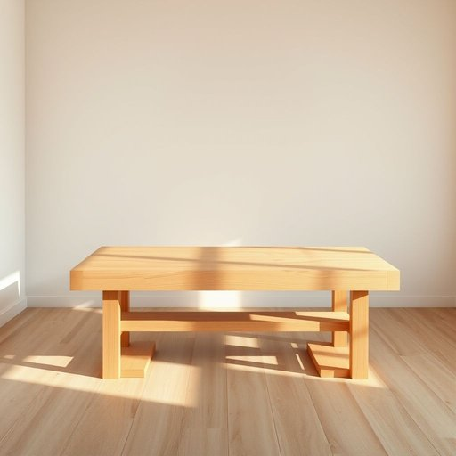

# workbench

<h1 style="font-size: 2.5em; font-weight: 300; letter-spacing: 2px; margin: 0; color: #2c3e50;">
/ˈwərkˌbɛnʧ/
</h1>

---

---

## 例句

After spending the entire afternoon organising his tools, dad finally cleared the clutter off the workbench, which had long been covered in paint stains and scattered screws, so that he could start assembling the new garden shed with ease and precision tomorrow morning.

*After(/ˈæftər/) spending(/ˈspɛndɪŋ/) the(/ðə/) entire(/ɪnˈtaɪər/) afternoon(/ˌæftərˈnun/) organising(/organising*/) his(/hɪz/) tools,(/tulz,/) dad(/dæd/) finally(/ˈfaɪnəli/) cleared(/klɪrd/) the(/ðə/) clutter(/ˈklətər/) off(/ɔf/) the(/ðə/) workbench,(/ˈwərkˌbɛnʧ,/) which(/wɪʧ/) had(/hæd/) long(/lɔŋ/) been(/bɪn/) covered(/ˈkəvərd/) in(/ɪn/) paint(/peɪnt/) stains(/steɪnz/) and(/ənd/) scattered(/ˈskætərd/) screws,(/skruz,/) so(/soʊ/) that(/ðət/) he(/hi/) could(/kʊd/) start(/stɑrt/) assembling(/əˈsɛmbəlɪŋ/) the(/ðə/) new(/nu/) garden(/ˈgɑrdən/) shed(/ʃɛd/) with(/wɪθ/) ease(/iz/) and(/ənd/) precision(/priˈsɪʒən/) tomorrow(/təˈmɑˌroʊ/) morning.(/ˈmɔrnɪŋ./)*

**翻译：** 爸爸花了整个下午整理工具，终于清理干净了工作台上的杂物。那工作台上早已布满油漆污渍和散落的螺丝，清理后他明天早晨便能轻松而精准地开始组装新的花园小屋。

---

## 解释

“workbench”作为名词在家居生活用品的语境中，指的是一种用于手工制作、修理或组装物品的工作台，通常具有坚固的桌面以及便于固定工具和材料的结构，常见于家庭车间、工房或车库。使用场合多见于木工、电工或爱好DIY活动时，人们将工具和材料置于其上进行操作。在语法上，“workbench”通常作为可数名词使用，常见搭配有“a workbench”，“the workbench”，“set up a workbench”，以及与具体动词搭配如“build a workbench”，“clean the workbench”。英语学习者应注意其复数形式为“workbenches”，以及该词常用作具体物理实体，不能轻易抽象化。词源方面，“workbench”由“work”（工作）和“bench”（长凳或长桌）复合而成，起源于中古英语时期，反映了手工劳动场所的专用家具，体现了工具与空间结合的概念。中文语境中，准确翻译为“工作台”或“工作长桌”，强调其实用与功能性，是家居中专供手工操作的固定桌面。该词无特殊褒贬含义，属于中性词，文化内涵主要关联于传统手工艺及家庭修理生活，强调动手能力和自给自足的生活理念。

---

<small style="color: #999; font-size: 0.9em;">2025-07-17 06:22:41</small>

