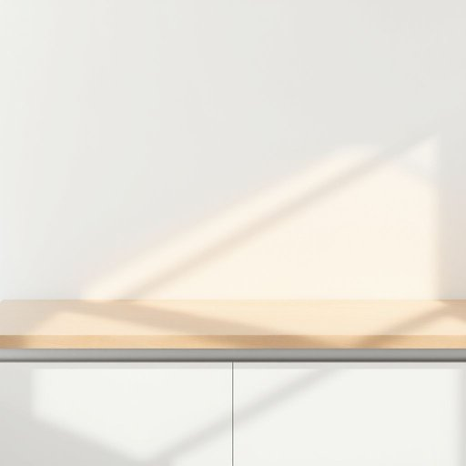

# worktop

<h1 style="font-size: 2.5em; font-weight: 300; letter-spacing: 2px; margin: 0; color: #2c3e50;">
/worktop*/
</h1>

---

---

## 例句

The worktop in the kitchen, despite its scratched surface, remains a central feature for meal preparation, offering a spacious area that many find indispensable for culinary activities.

*The(/ðə/) worktop(/worktop*/) in(/ɪn/) the(/ðə/) kitchen,(/ˈkɪʧən,/) despite(/dɪˈspaɪt/) its(/ɪts/) scratched(/skræʧt/) surface,(/ˈsərfəs,/) remains(/rɪˈmeɪnz/) a(/ə/) central(/ˈsɛntrəl/) feature(/ˈfiʧər/) for(/fər/) meal(/mil/) preparation,(/ˌprɛpərˈeɪʃən,/) offering(/ˈɔfərɪŋ/) a(/ə/) spacious(/ˈspeɪʃəs/) area(/ˈɛriə/) that(/ðət/) many(/ˈmɛni/) find(/faɪnd/) indispensable(/ˌɪndɪˈspɛnsəbəl/) for(/fər/) culinary(/ˈkjulɪˌnɛri/) activities.(/ækˈtɪvɪtiz./)*

**翻译：** 厨房的操作台表面虽有划痕，但仍是备餐的重要区域，提供宽敞的空间，许多人认为这是烹饪活动中不可或缺的部分。

---

## 解释

“worktop”作为名词在家居生活用品的语境中，通常指厨房或工作区域中用于准备食物或放置物品的平坦台面，常见于厨房台面、洗衣间的操作台面等场合。使用时多见于厨房布置、装修设计和家居用品描述中，表示功能性强且日常接触频繁的表面空间。英语学习者需注意，“worktop”多为可数名词，一般以单数形式出现，复数形式为“worktops”，常见搭配有“kitchen worktop”（厨房台面）、“granite worktop”（花岗岩台面）等，用于具体描述材料或位置时后置修饰较多；此外，注意其与“countertop”含义接近但英式英语中“worktop”更常用，尤其在英国，而美式英语多用“countertop”。关于词源，“worktop”由“work”（工作、操作）与“top”（顶部、表面）组合而成，直观表达为“工作用的表面”，该构词方式简单明了，体现其功能属性。中文语境中“worktop”通常精准翻译为“操作台面”或“厨房台面”，强调其作为厨房或工作区的平面操作空间，含义中性无褒贬色彩，属于生活中常见的实用名词，文化内涵主要体现在居家生活的便利与实用性上。

---

<small style="color: #999; font-size: 0.9em;">2025-07-17 06:22:41</small>

