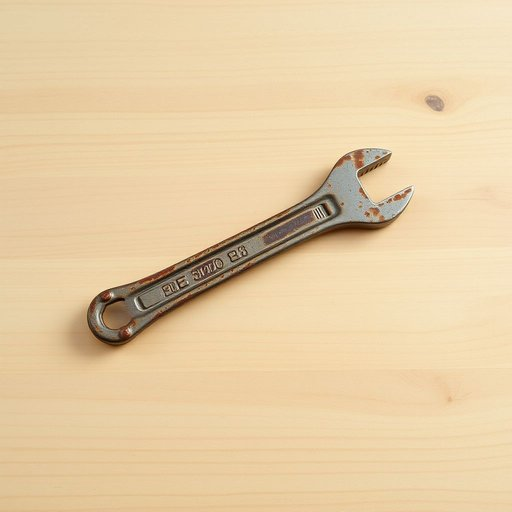

# wrench

<h1 style="font-size: 2.5em; font-weight: 300; letter-spacing: 2px; margin: 0; color: #2c3e50;">
/rɛnʧ/
</h1>

---

---

## 例句

Could you please hand me the adjustable wrench from the toolbox on the workbench, the one with the slightly rusted handle that my granddad gave me, so I can finally tighten the loose pipe under the kitchen sink that’s been dripping since last week?

*Could(/kʊd/) you(/ju/) please(/pliz/) hand(/hænd/) me(/mi/) the(/ðə/) adjustable(/əˈʤəstəbəl/) wrench(/rɛnʧ/) from(/frəm/) the(/ðə/) toolbox(/ˈtulˌbɔks/) on(/ɔn/) the(/ðə/) workbench,(/ˈwərkˌbɛnʧ,/) the(/ðə/) one(/wən/) with(/wɪθ/) the(/ðə/) slightly(/sˈlaɪtli/) rusted(/ˈrəstɪd/) handle(/ˈhændəl/) that(/ðət/) my(/maɪ/) granddad(/ˈgrænˌdæd/) gave(/geɪv/) me,(/mi,/) so(/soʊ/) I(/aɪ/) can(/kən/) finally(/ˈfaɪnəli/) tighten(/ˈtaɪtən/) the(/ðə/) loose(/lus/) pipe(/paɪp/) under(/ˈəndər/) the(/ðə/) kitchen(/ˈkɪʧən/) sink(/sɪŋk/) that’s(/that’s*/) been(/bɪn/) dripping(/ˈdrɪpɪŋ/) since(/sɪns/) last(/læst/) week?(/wik?/)*

**翻译：** 请你从工作台上的工具箱里把那把带点锈迹、是我爷爷留给我的活动扳手递给我，好让我终于能拧紧上周起一直在滴水的厨房水槽下那根松动的水管。

---

## 解释

英语单词“wrench”作为名词在家居生活用品场景中，通常指一种用于拧紧或松开螺母、螺栓等机械连接件的工具，中文一般译为“扳手”或“板手”。具体使用场合包括修理家具、装配家电、管道维修等，常见于描述使用工具进行手工操作的语境中。英语学习者需要注意，“wrench”作为名词通常是可数名词，常见搭配有“adjustable wrench”（可调扳手）、“pipe wrench”（管钳）等，不同类型的扳手名称往往带有定语，表示其用途或形态。语法上，名词“wrench”在句中通常作主语、宾语或介词宾语使用，复数形式为“wrenches”。在词源方面，“wrench”起源于中古英语，来源于古英语“wrencan”，意为扭动或拧转，与动词“wrench”同源，反映出其作为工具的功能特性。中文语境中，“wrench”准确理解为一种专用工具，与普通“钳子”或“锤子”区分开，且不会有贬义或褒义色彩，属于中性词汇。需要注意的是，在英语中“wrench”作为动词还有“猛拉、猛拧”的含义，但作为家居工具名词时只指“扳手”，避免混淆。整体而言，“wrench”一词在家居生活领域中代表的是实用的机械工具，语言色彩朴素且功能明确。

---

<small style="color: #999; font-size: 0.9em;">2025-07-17 06:22:41</small>

