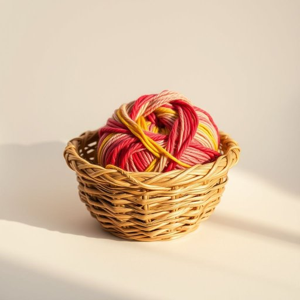

# yarn

<h1 style="font-size: 2.5em; font-weight: 300; letter-spacing: 2px; margin: 0; color: #2c3e50;">
/jɑrn/
</h1>

---

---

## 例句

I found a tangled ball of colourful yarn in the basket, which, although a bit frayed at the edges from being left out too long, is perfect for the knitting project I’ve been planning to start this weekend, especially now that the evenings are getting colder and cozier.

*I(/aɪ/) found(/faʊnd/) a(/ə/) tangled(/ˈtæŋgəld/) ball(/bɔl/) of(/əv/) colourful(/colourful*/) yarn(/jɑrn/) in(/ɪn/) the(/ðə/) basket,(/ˈbæskət,/) which,(/wɪʧ,/) although(/ˌɔlˈðoʊ/) a(/ə/) bit(/bɪt/) frayed(/freɪd/) at(/æt/) the(/ðə/) edges(/ˈɛʤɪz/) from(/frəm/) being(/biɪŋ/) left(/lɛft/) out(/aʊt/) too(/tu/) long,(/lɔŋ,/) is(/ɪz/) perfect(/ˈpərˌfɪkt/) for(/fər/) the(/ðə/) knitting(/ˈnɪtɪŋ/) project(/ˈprɑʤɛkt/) I’ve(/i’ve*/) been(/bɪn/) planning(/ˈplænɪŋ/) to(/tɪ/) start(/stɑrt/) this(/ðɪs/) weekend,(/ˈwiˌkɪnd,/) especially(/əˈspɛʃəli/) now(/naʊ/) that(/ðət/) the(/ðə/) evenings(/ˈivnɪŋz/) are(/ər/) getting(/ˈgɪtɪŋ/) colder(/ˈkoʊldər/) and(/ənd/) cozier.(/ˈkoʊziər./)*

**翻译：** 我在篮子里发现了一团缠成一团的五彩毛线，虽然边缘因为放置太久有些磨损，但正好适合我计划这个周末开始的编织项目，尤其是现在夜晚渐渐变得寒冷而温馨。

---

## 解释

英语单词yarn作为名词在家居生活用品的语境中主要指用来编织缝纫或手工艺制作的纱线或毛线常见于毛衣围巾毯子等织物的制作场合使用时英语学习者需要注意yarn通常不可数但在表示种类或数量时也可用复数形式yarns如different yarns常见搭配有knitting yarn编织毛线cotton yarn棉纱线等此外yarn常与动词搭配使用如buy yarn买毛线spin yarn纺纱线语法上yarn作为物质名词多用单数若要表达多股线则用strands of yarn词源上yarn来自古英语garn或gearn与纺织相关源自日耳曼语族历史悠久反映了手工纺织的重要性在中文语境中yarn准确翻译为纱线或毛线具体应根据材质和用途选择如毛线偏向羊毛类纱线则更广泛包括棉麻等需要注意的是yarn在某些英语口语表达中还有讲故事或编故事的引申义但在家居用品语境中无此含义无褒贬色彩属于中性词汇强调的是材料和手工特性是手工爱好者和纺织领域常用且基础的词汇

---

<small style="color: #999; font-size: 0.9em;">2025-07-17 06:22:41</small>

