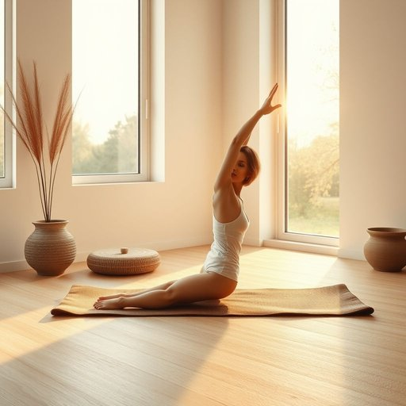

# yoga-mat

<h1 style="font-size: 2.5em; font-weight: 300; letter-spacing: 2px; margin: 0; color: #2c3e50;">
/yoga-mat*/
</h1>

---

---

## 例句

After unrolling her worn but comfortable yoga-mat next to the window, where the morning light streamed in creating the perfect serene corner, Emma began her daily stretches and meditation practice in the living room.

*After(/ˈæftər/) unrolling(/ˌənˈroʊlɪŋ/) her(/hər/) worn(/wɔrn/) but(/bət/) comfortable(/ˈkəmfərtəbəl/) yoga-mat(/yoga-mat*/) next(/nɛkst/) to(/tɪ/) the(/ðə/) window,(/ˈwɪndoʊ,/) where(/wɛr/) the(/ðə/) morning(/ˈmɔrnɪŋ/) light(/laɪt/) streamed(/strimd/) in(/ɪn/) creating(/kriˈeɪtɪŋ/) the(/ðə/) perfect(/ˈpərˌfɪkt/) serene(/sərˈin/) corner,(/ˈkɔrnər,/) Emma(/ˈɛmə/) began(/bɪˈgæn/) her(/hər/) daily(/ˈdeɪli/) stretches(/ˈstrɛʧɪz/) and(/ənd/) meditation(/ˌmɛdəˈteɪʃən/) practice(/ˈpræktɪs/) in(/ɪn/) the(/ðə/) living(/ˈlɪvɪŋ/) room.(/rum./)*

**翻译：** 艾玛在窗边铺开她那张虽已磨损但依旧舒适的瑜伽垫，晨光透过窗户洒进来，营造出一个宁静恬淡的角落。随后，她开始在客厅进行每日的拉伸和冥想练习。

---

## 解释

英语单词“yoga-mat”作为名词，指的是瑜伽垫，是一种用于瑜伽练习时铺设在地面上的软垫，主要目的是提供舒适的支撑和防滑的表面，常见于家庭、健身房、瑜伽馆等场所。英语学习者在使用“yoga-mat”时应注意它是一个复合名词，通常作为单数或复数形式(yoga-mats)出现，前面可以搭配定冠词(the yoga mat)、不定冠词(a yoga mat)、指示代词(this/that yoga mat)等，且常见的搭配有“roll out a yoga mat”（铺开瑜伽垫）、“buy a yoga mat”（买瑜伽垫）、“clean the yoga mat”（清洁瑜伽垫）等。词源方面，“yoga”来源于梵语“yuj”，意为连接、联合，是一种起源于印度的身心锻炼方法，“mat”则是英语中表示垫子、席子的词，两者结合反映出该词专门指代用于瑜伽练习的垫子。在中文语境中，“yoga-mat”准确翻译为“瑜伽垫”，强调其为瑜伽专用的垫子，使用时往往带有健康、运动和轻松生活方式的色彩，且无褒贬含义，属于中性词汇，需注意不要误用成泛指任何类型的垫子或地垫。

---

<small style="color: #999; font-size: 0.9em;">2025-07-17 06:22:41</small>

