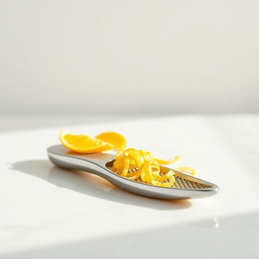

# zester

<h1 style="font-size: 2.5em; font-weight: 300; letter-spacing: 2px; margin: 0; color: #2c3e50;">
/zester*/
</h1>

---

---

## 例句

Whenever I’m baking, I always reach for the zester, which, despite its small size, proves indispensable for finely grating citrus peel to add a subtle burst of flavour to cakes, muffins, or even homemade dressings, making it one of the most versatile and cherished tools in my kitchen drawer.

*Whenever(/wɛˈnɛvər/) I’m(/i’m*/) baking,(/ˈbeɪkɪŋ,/) I(/aɪ/) always(/ˈɔlˌweɪz/) reach(/riʧ/) for(/fər/) the(/ðə/) zester,(/zester*,/) which,(/wɪʧ,/) despite(/dɪˈspaɪt/) its(/ɪts/) small(/smɔl/) size,(/saɪz,/) proves(/pruvz/) indispensable(/ˌɪndɪˈspɛnsəbəl/) for(/fər/) finely(/ˈfaɪnli/) grating(/ˈgreɪtɪŋ/) citrus(/ˈsɪtrəs/) peel(/pil/) to(/tɪ/) add(/æd/) a(/ə/) subtle(/ˈsətəl/) burst(/bərst/) of(/əv/) flavour(/flavour*/) to(/tɪ/) cakes,(/keɪks,/) muffins,(/ˈməfənz,/) or(/ər/) even(/ˈivɪn/) homemade(/ˈhoʊˈmeɪd/) dressings,(/ˈdrɛsɪŋz,/) making(/ˈmeɪkɪŋ/) it(/ɪt/) one(/wən/) of(/əv/) the(/ðə/) most(/moʊst/) versatile(/ˈvərsətəl/) and(/ənd/) cherished(/ˈʧɛrɪʃt/) tools(/tulz/) in(/ɪn/) my(/maɪ/) kitchen(/ˈkɪʧən/) drawer.(/drɔr./)*

**翻译：** 每当我烘焙时，总会拿起那把小小的刨皮器。尽管体积不大，它却是不可或缺的，能够细细刨出柑橘皮，给蛋糕、松饼甚至自制调味酱增添一抹细腻的风味，使它成为我厨房抽屉里最百搭、最珍爱的工具之一。

---

## 解释

“zester”作为名词在家居生活用品的语境中指的是一种厨房用具，主要用于刨取柠檬、橙子等水果的表皮细丝，常用于烹饪中为菜肴或饮品增添柑橘香味。具体使用场合通常是在烹饪或调制饮食时，尤其涉及制作甜点、调味品或鸡尾酒时需要新鲜柑橘表皮香气的情形。英语学习者需要注意的是，“zester”作为名词使用时不可直接加复数形式，通常指单一工具，如果是多个则用“zesters”；此外，它常与动词“use”搭配，如“use a zester to zest lemons”（用zester刨柠檬皮）。语法上，“zester”是可数名词，无特殊语法变化，常见表达包括“lemon zester”、“citrus zester”等，强调功能和使用对象。在词源方面，“zester”源自动词“zest”，其古法语和拉丁词根与剥取有关，指刨取柑橘皮丁的动作，逐步引申出指代该工具名称。因此，zester既是动作的承担者也是工具。中文语境中准确翻译为“柠檬刨皮器”或“柑橘刨皮器”，强调其实用价值和功能性，没有褒贬色彩，属于中性词汇，代表一种简洁方便的厨房小工具，反映了西方家庭烹饪文化中对食材香味提取的重视和细致操作的习惯。

---

<small style="color: #999; font-size: 0.9em;">2025-07-17 06:22:41</small>

